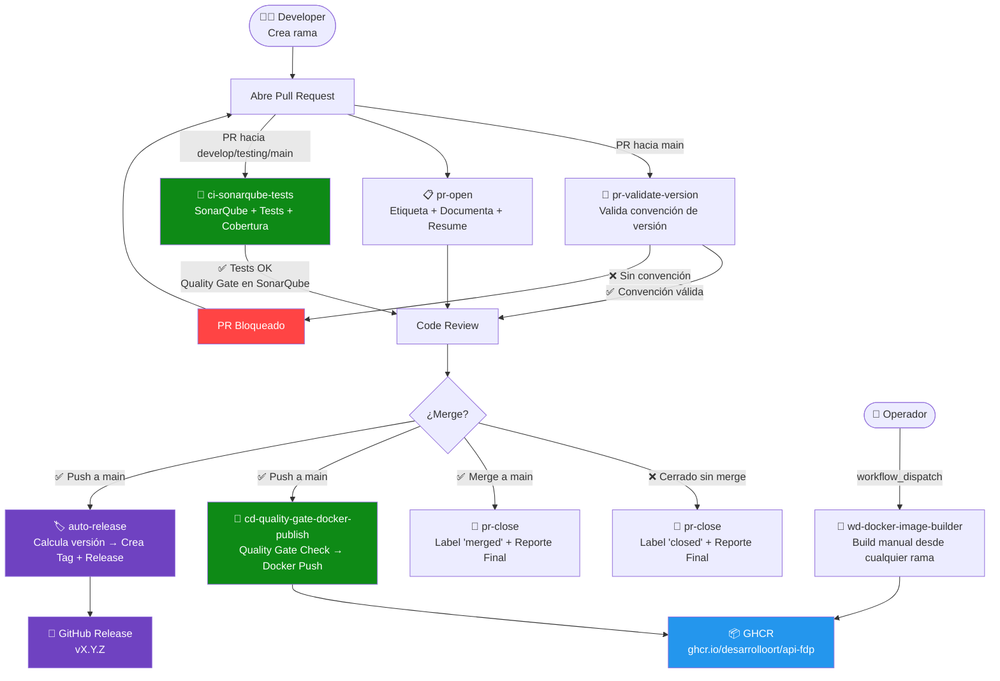
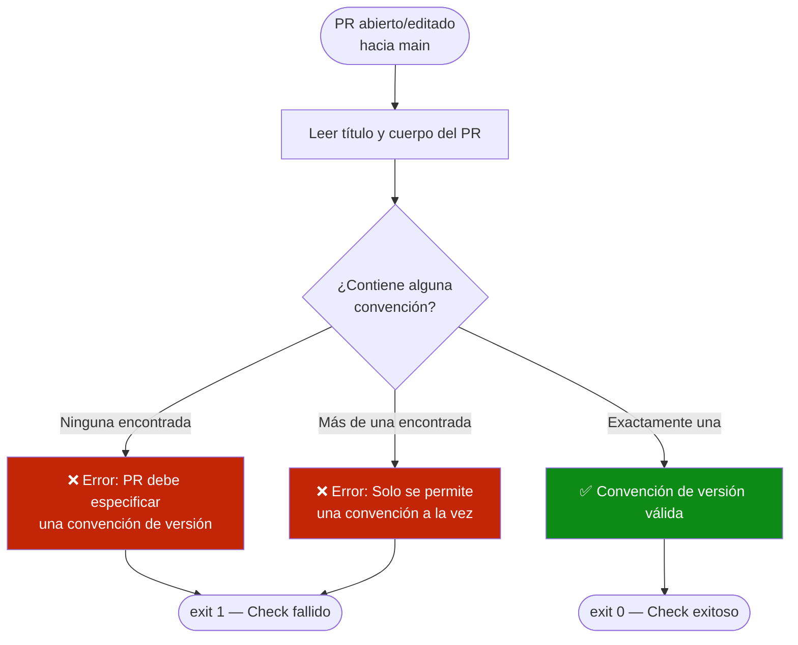
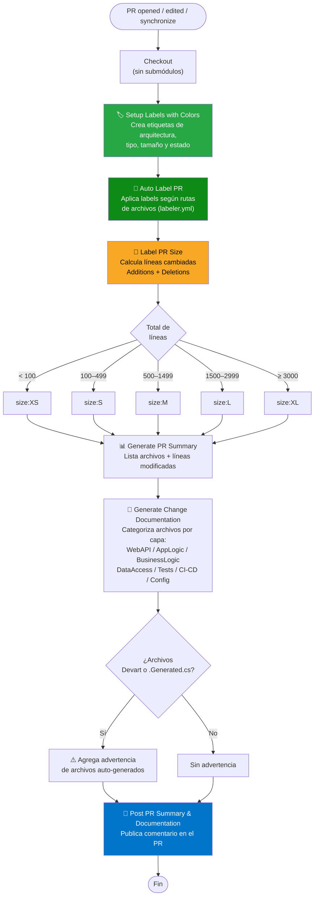
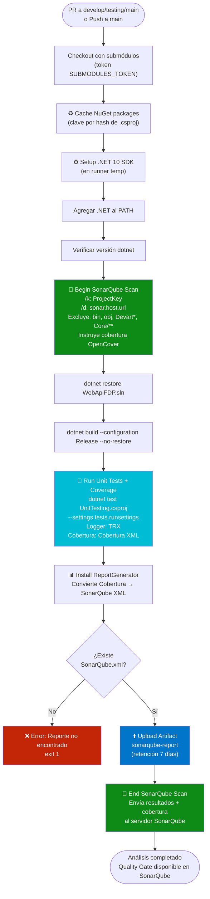
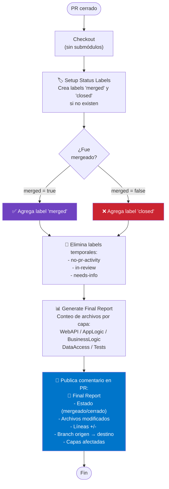
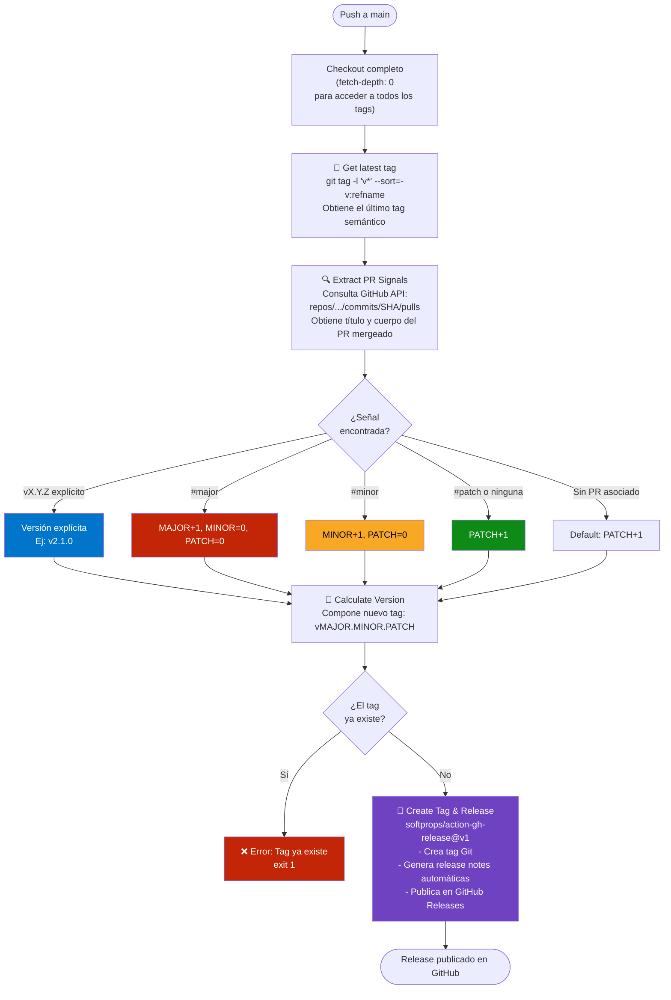
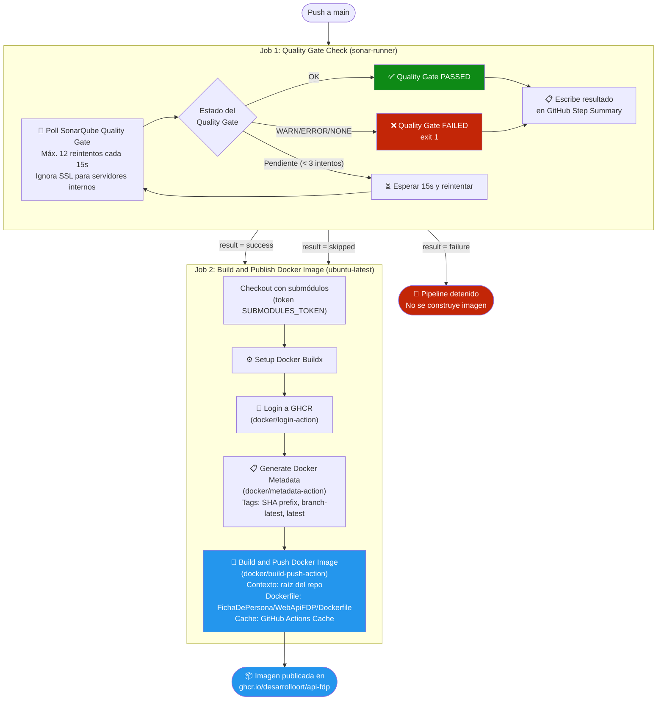
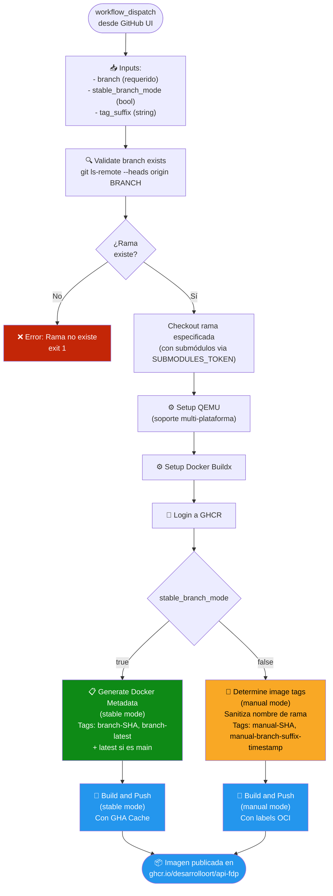

# DevOps Workflows — API Ficha de Persona (FDP)

Documentación completa de los flujos de CI/CD del repositorio. Todos los workflows se encuentran en `.github/workflows/`.

---

## Tabla de Contenidos

- [Resumen de Workflows](#resumen-de-workflows)
- [Ciclo de Vida DevOps (Visión General)](#ciclo-de-vida-devops-visión-general)
- [1. pr-validate-version — Validación de Convención de Versión](#1-pr-validate-version)
- [2. pr-open — Auto Documentación y Etiquetado de PR](#2-pr-open)
- [3. ci-sonarqube-tests — CI: Análisis de Calidad y Tests](#3-ci-sonarqube-tests)
- [4. pr-close — Actualización de Estado al Cerrar PR](#4-pr-close)
- [5. auto-release — Release Automático con Versionado Semántico](#5-auto-release)
- [6. cd-quality-gate-docker-publish — CD: Quality Gate y Publicación Docker](#6-cd-quality-gate-docker-publish)
- [7. wd-docker-image-builder — Builder Manual de Imágenes Docker](#7-wd-docker-image-builder)
- [Secretos Requeridos](#secretos-requeridos)

---

## Resumen de Workflows

| Archivo | Nombre | Trigger | Runner | Propósito |
|---|---|---|---|---|
| `pr-validate-version.yml` | Validate PR Version Convention | PR → `main` | `ubuntu-latest` | Valida que el PR incluya convención de versión |
| `pr-open.yml` | PR – Auto Document, Label & Summarize | PR abierto/editado/sync | `ubuntu-latest` | Etiqueta, documenta y resume el PR automáticamente |
| `ci-sonarqube-tests.yml` | CI - SonarQube and Tests | PR → `develop/testing/main`, push `main` | `sonar-runner` | Análisis estático, cobertura y tests unitarios |
| `pr-close.yml` | PR – Update Status on Close | PR cerrado | `ubuntu-latest` | Actualiza labels y genera reporte final |
| `auto-release.yml` | Auto Release (Semantic Versioning) | Push → `main` | `ubuntu-latest` | Crea tag y release de GitHub automáticamente |
| `cd-quality-gate-docker-publish.yml` | CI/CD - SonarQube, Tests and Docker Publish | Push → `main` | `sonar-runner` + `ubuntu-latest` | Quality Gate + Build y publicación de imagen Docker |
| `wd-docker-image-builder.yml` | Docker Image Builder | `workflow_dispatch` (manual) | `ubuntu-latest` | Construcción manual de imágenes Docker |

---

## Ciclo de Vida DevOps (Visión General)

Diagrama de alto nivel que muestra cómo interactúan todos los workflows a lo largo del ciclo de vida de un cambio.

---

## 1. pr-validate-version

**Archivo:** `pr-validate-version.yml`  
**Trigger:** Pull Request hacia `main` (opened, edited, reopened, synchronize)  
**Runner:** `ubuntu-latest`

### Qué hace

Valida que el título o cuerpo del PR incluya **exactamente una** convención de versión antes de permitir el merge a `main`. Actúa como gate de calidad de versionado.

**Convenciones aceptadas (exactamente una de las siguientes):**
- `vX.Y.Z` — versión explícita (ej: `v2.1.0`)
- `#major` — incremento de versión mayor
- `#minor` — incremento de versión menor
- `#patch` — incremento de versión de parche

### Diagrama de Ejecución

---

## 2. pr-open

**Archivo:** `pr-open.yml`  
**Trigger:** Pull Request (opened, edited, synchronize) — cualquier rama  
**Runner:** `ubuntu-latest`  
**Concurrencia:** Un job por número de PR (cancela ejecuciones previas del mismo PR)

### Qué hace

Automatiza la gestión documental de cada PR en cuatro pasos secuenciales:

1. **Setup de Labels:** Crea o actualiza todas las etiquetas del repositorio con sus colores (capas de arquitectura, tipos de archivos, tamaños, estados).
2. **Auto Labeling:** Aplica etiquetas según las rutas de archivos modificados usando `.github/labeler.yml`.
3. **Label de Tamaño:** Calcula el total de líneas cambiadas y aplica `size:XS/S/M/L/XL`.
4. **Resumen y Documentación:** Publica un comentario automático en el PR con la lista de archivos modificados y la categorización por capa de arquitectura.

### Diagrama de Ejecución

---

## 3. ci-sonarqube-tests

**Archivo:** `ci-sonarqube-tests.yml`  
**Trigger:**
  - Pull Requests hacia `develop`, `testing`, `main` (opened, synchronize, reopened)
  - Push directo a `main`

**Runner:** `sonar-runner` (self-hosted con SonarScanner.MSBuild instalado)  
**Concurrencia:** Un job por workflow + ref (cancela ejecuciones previas)  
**Timeout:** 30 minutos

### Qué hace

Pipeline de integración continua completo que ejecuta análisis de calidad estático con SonarQube y los tests unitarios con cobertura de código.

### Diagrama de Ejecución

---

## 4. pr-close

**Archivo:** `pr-close.yml`  
**Trigger:** Pull Request cerrado (`types: [closed]`) — cualquier rama  
**Runner:** `ubuntu-latest`  
**Timeout:** 5 minutos

### Qué hace

Al cerrarse un PR (con o sin merge), actualiza las etiquetas de estado y genera un reporte final con métricas del PR.

### Diagrama de Ejecución

---

## 5. auto-release

**Archivo:** `auto-release.yml`  
**Trigger:** Push a `main`  
**Runner:** `ubuntu-latest`  
**Permisos:** `contents: write` (para crear tags y releases)

### Qué hace

Crea automáticamente un tag de Git y un GitHub Release cuando se mergea código a `main`. La versión se calcula leyendo las señales del PR mergeado usando versionado semántico.

**Reglas de cálculo de versión:**
- Si el PR contiene `vX.Y.Z` explícito → usa esa versión
- Si contiene `#major` → incrementa MAJOR, resetea MINOR y PATCH
- Si contiene `#minor` → incrementa MINOR, resetea PATCH
- Si contiene `#patch` o ninguna señal → incrementa PATCH
- Si el tag calculado ya existe → falla con error

### Diagrama de Ejecución

---

## 6. cd-quality-gate-docker-publish

**Archivo:** `cd-quality-gate-docker-publish.yml`  
**Trigger:** Push a `main`  
**Runners:** `sonar-runner` (Job 1) + `ubuntu-latest` (Job 2)  
**Concurrencia:** Un job por workflow + ref (cancela ejecuciones previas)

### Qué hace

Pipeline de entrega continua en dos jobs secuenciales. Primero verifica que el análisis de SonarQube haya pasado el Quality Gate, y solo si pasa, construye y publica la imagen Docker en GHCR.

**Tags Docker generados al hacer push a `main`:**
- `ghcr.io/desarrolloort/api-fdp:main-<SHA>`
- `ghcr.io/desarrolloort/api-fdp:main-latest`
- `ghcr.io/desarrolloort/api-fdp:latest`

### Diagrama de Ejecución

---

## 7. wd-docker-image-builder

**Archivo:** `wd-docker-image-builder.yml`  
**Trigger:** `workflow_dispatch` (ejecución manual desde GitHub Actions UI)  
**Runner:** `ubuntu-latest`  
**Timeout:** 30 minutos

### Qué hace

Permite a un operador construir y publicar manualmente una imagen Docker desde **cualquier rama** del repositorio. Ofrece dos modos de operación:

| Input | Descripción | Requerido |
|---|---|---|
| `branch` | Nombre de la rama a construir | ✅ Sí |
| `stable_branch_mode` | Usa tags igual que el CI/CD automático | No (default: `false`) |
| `tag_suffix` | Sufijo personalizado para la imagen | No (default: `"manual"`) |

**Modo `stable_branch_mode = true`** — Tags generados:
- `ghcr.io/desarrolloort/api-fdp:<branch>-<SHA>`
- `ghcr.io/desarrolloort/api-fdp:<branch>-latest`
- `ghcr.io/desarrolloort/api-fdp:latest` *(solo si rama es `main`)*

**Modo `stable_branch_mode = false`** — Tags generados:
- `ghcr.io/desarrolloort/api-fdp:manual-<SHA>`
- `ghcr.io/desarrolloort/api-fdp:manual-<branch>-<suffix>-<timestamp>`

### Diagrama de Ejecución

---

## Secretos Requeridos

| Secreto | Usado en | Descripción |
|---|---|---|
| `GITHUB_TOKEN` | Todos | Token automático de GitHub Actions |
| `SUBMODULES_TOKEN` | `ci-sonarqube-tests`, `cd-quality-gate-docker-publish`, `wd-docker-image-builder` | PAT con acceso al submódulo privado `Core` |
| `SONAR_TOKEN` | `ci-sonarqube-tests`, `cd-quality-gate-docker-publish` | Token de autenticación para SonarQube |
| `SONAR_HOST_URL` | `ci-sonarqube-tests`, `cd-quality-gate-docker-publish` | URL del servidor SonarQube interno |
| `SONAR_PROJECT_KEY` | `ci-sonarqube-tests`, `cd-quality-gate-docker-publish` | Clave del proyecto en SonarQube |

> **Nota:** `SUBMODULES_TOKEN` es crítico. Sin él, el checkout del submódulo `Core` falla y el build no puede completarse. Ver la sección de prerrequisitos en [copilot-instructions.md](../copilot-instructions.md).
