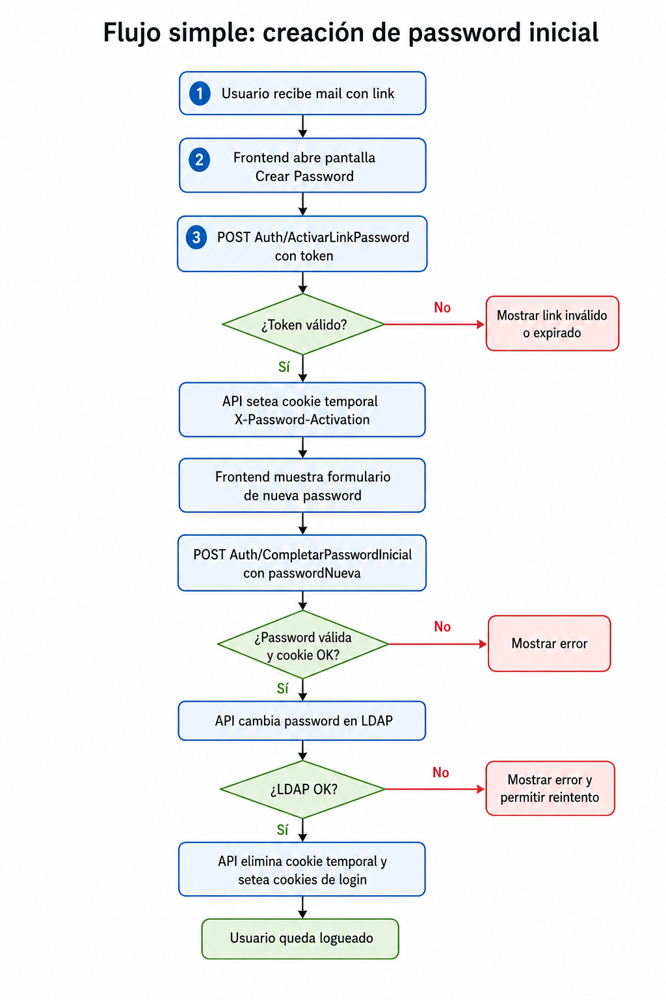

# Flujo simple: creacion de password inicial

Diagrama corto para que el frontend entienda el flujo del link de creacion de password inicial.

## Resumen para frontend

1. Abrir la pantalla de crear password usando el token recibido en el link del mail.
2. Llamar a `POST Auth/ActivarLinkPassword` enviando `{ "token": "..." }`.
3. Si la respuesta es exitosa, la API setea la cookie temporal `X-Password-Activation`.
4. Mostrar el formulario de nueva password.
5. Llamar a `POST Auth/CompletarPasswordInicial` enviando `{ "passwordNueva": "..." }`.
6. Si LDAP responde OK, la API elimina la cookie temporal y setea las cookies normales de login.

La cookie `X-Password-Activation` solo sirve para completar este flujo. No autentica al usuario para consumir otros servicios.
