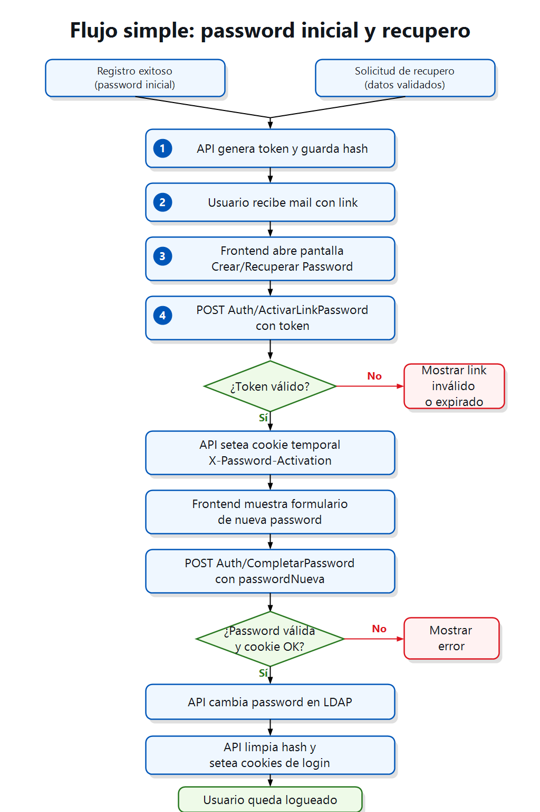

# Flujo simple: password inicial y recupero

Diagrama corto para que el frontend entienda que la creacion de password inicial y el recupero de password comparten el mismo flujo luego de recibir el link por mail.

## Resumen para frontend

1. El flujo puede iniciar por registro exitoso o por solicitud de recupero.
2. La API genera un token seguro, guarda el hash en la persona y envia un mail con link.
3. El usuario abre el link y el frontend llama a `POST Auth/ActivarLinkPassword` enviando `{ "token": "..." }`.
4. Si la respuesta es exitosa, la API setea la cookie temporal `X-Password-Activation`.
5. El frontend muestra el formulario de nueva password y llama a `POST Auth/CompletarPassword` enviando `{ "passwordNueva": "..." }`.
6. Si LDAP responde OK, la API limpia el hash, elimina la cookie temporal, setea las cookies normales y el usuario queda logueado.

El parametro `flow` del link es solo para UX del frontend. La API valida el `purpose` firmado dentro del token.

La cookie `X-Password-Activation` solo sirve para completar el cambio de password. No autentica al usuario para consumir otros servicios.
