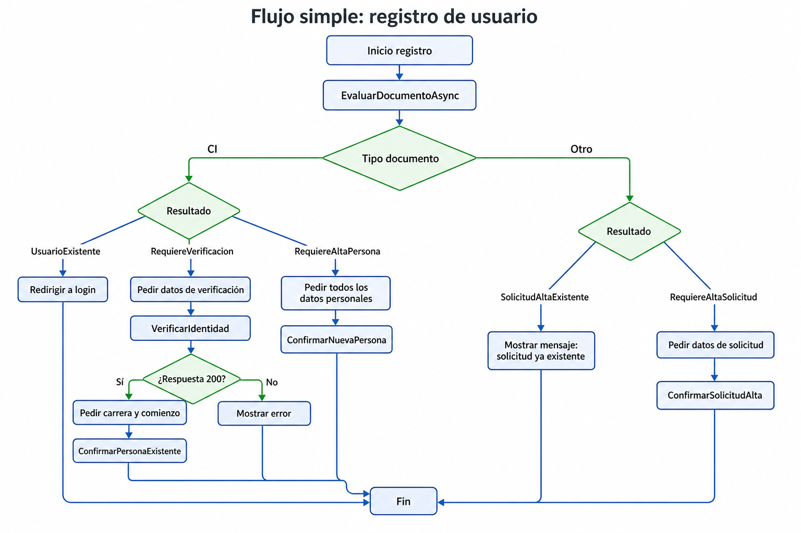

# Flujo simple: registro de usuario

Diagrama corto para que el frontend entienda las ramas principales del registro segun el documento ingresado.

## Resumen para frontend

1. Iniciar el registro llamando a `EvaluarDocumentoAsync`.
2. Si el documento es `CI`, resolver la rama segun el resultado:
   - `UsuarioExistente`: redirigir a login.
   - `RequiereVerificacion`: pedir datos de verificacion y llamar a `VerificarIdentidad`; si valida, se envia el mail para activar la password.
   - `RequiereAltaPersona`: pedir datos personales y llamar a `ConfirmarNuevaPersona`.
3. Si el documento es otro tipo, resolver la rama de solicitud de alta:
   - `SolicitudAltaExistente`: mostrar mensaje de solicitud existente.
   - `RequiereAltaSolicitud`: pedir datos de solicitud y llamar a `ConfirmarSolicitudAlta`.
4. La seleccion academica queda fuera del registro inicial y se resuelve luego desde el flujo de inscripcion/interes.
