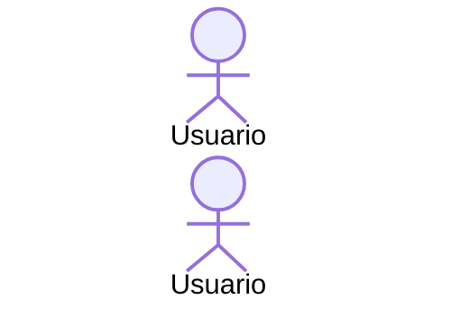

# Baseline de documentacion

> Tipo: standards

Esta guia define como documentar features compartidas entre frontend y backend. OpenAPI sigue siendo la fuente del contrato tecnico; Markdown documenta el comportamiento funcional que Swagger no puede explicar bien.

## Regla principal

Cada feature importante debe tener un documento funcional en este portal cuando cumple al menos una condicion:

- toca mas de una pantalla o endpoint;
- tiene decisiones de negocio, estados o casos borde;
- usa cookies, Redis, captcha, archivos, emails, jobs o integraciones externas;
- requiere coordinacion entre frontend y backend.

OpenAPI responde **que se envia por HTTP**. El Markdown responde **que pasa en el producto**.

## Que documenta OpenAPI

El Swagger debe cubrir el wire contract:

- path, metodo, request, response y status codes;
- autenticacion, cookies, headers y captcha si aplican;
- ejemplos representativos de request/response;
- errores tecnicos y codigos funcionales expuestos por la API;
- deprecaciones y compatibilidad de versiones.

Si el contrato generado queda con `response: unknown`, nombres ambiguos o shapes que no discriminan estados reales, se corrige en backend y se regenera con `npm run update-api`.

## Que documenta Markdown

Cada documento funcional debe incluir, como minimo:

- frontmatter de Docusaurus (`slug`, `title`, `description`);
- `businessId` estable y `sourcePaths` para los flujos canonicos;
- `Tipo`: `explanation`, `how-to`, `reference` o `standards`;
- diagrama Mermaid para flujos con mas de un paso;
- tabla de acciones visibles: UI, service/facade, adapter, API y backend;
- contratos y estados funcionales, sin duplicar DTOs completos;
- sesiones, cookies, Redis, cache, storage, emails y side effects;
- errores esperados, casos borde e idempotencia;
- seguridad: captcha, datos sensibles, rate limits, permisos y expiraciones;
- evidencia: tests front, tests back, controller/service y configuracion relevante;
- links a Figma solo con URL verificada al nodo exacto (`node-id`).

## Responsabilidades

### Frontend

El frontend aporta:

- rutas, pages, components, facades, services, adapters y guards/interceptors;
- mapeo entre tipos generados y tipos estables de feature;
- estados de UI: loading, errores, empty states, redirecciones y retries;
- validaciones visibles y normalizaciones antes del request;
- storage/cache local y limpieza de estado;
- accesibilidad y tests relevantes.

### Backend

El backend aporta:

- controller, service, helpers, jobs e integraciones tocadas por el flujo;
- TTLs, Redis, cookies, emails, colas, LDAP/DB y efectos persistentes;
- reglas que Swagger no expresa: idempotencia, prioridad de flags, reintentos, rate limits y expiraciones;
- codigos funcionales y mensajes relevantes;
- tests unitarios/integracion y configuracion (`appsettings`, feature flags).

## Plantilla minima

````markdown
---
slug: /flujos/<feature>
title: <Feature>
description: <Que explica el documento>
businessId: admisiones.<feature>
sourcePaths:
  - src/app/features/<feature>/
---

# <Feature>

> Tipo: explanation

Resumen breve del caso de uso y alcance.

## Recorrido completo



## Acciones y referencias

| Accion visible | Angular | Servicio | Adapter/API | Backend |
| -------------- | ------- | -------- | ----------- | ------- |

## Estados, contratos y sesiones

## Casos borde y seguridad

## Evidencia
````

## Practicas

- No copiar DTOs completos desde Swagger; enlazar el contrato y explicar solo lo necesario para entender el flujo.
- No documentar aspiraciones. Si no esta implementado o verificado, marcarlo como pendiente o no incluirlo.
- Preferir links a commits o rutas estables de repo para evidencia.
- Actualizar el Markdown en el mismo PR que cambia comportamiento.
- Si el cambio rompe una decision previa, cambiar el documento antes de cambiar el codigo o en el mismo commit.
