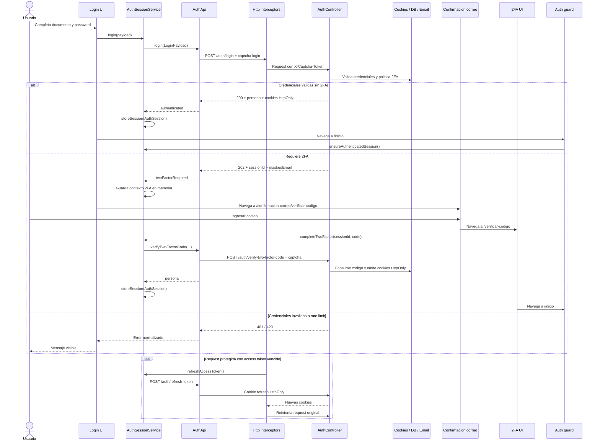

import SourceLink from '@site/src/components/SourceLink';

# Inicio de sesion

> Tipo: explanation

Este documento cubre el inicio de sesion con credenciales, la rama de verificacion por correo en dos factores, la hidratacion de sesion para rutas protegidas y el refresh automatico de access token.

## Recorrido completo

## Acciones y referencias

| Accion visible             | Angular                                                                     | Servicio                                   | Adapter y contrato                            | API / Backend                       |
| -------------------------- | --------------------------------------------------------------------------- | ------------------------------------------ | --------------------------------------------- | ----------------------------------- |
| Iniciar sesion             | `Login.submit()` en `src/app/features/auth/pages/login/login.ts`            | `AuthSessionService.login()`               | `AuthApi.login()` mapea `LoginResult`         | `POST /auth/login`                  |
| Ver confirmacion de codigo | `/confirmacion-correo/verificar-codigo` usa `TWO_FACTOR_EMAIL_CONFIRMATION` | Contexto 2FA queda en `AuthSessionService` | Respuesta 202 con `sessionId` y `maskedEmail` | Email con codigo 2FA                |
| Ingresar codigo            | `TwoFactorValidationPage.verify()` y componente `TwoFactorValidation`       | `completeTwoFactor(...)`                   | `verifyTwoFactorCode(...)`                    | `POST /auth/verify-two-factor-code` |
| Reenviar codigo            | `TwoFactorValidationPage.resend()`                                          | `resendTwoFactorCode(sessionId)`           | `resendTwoFactorCode(...)`                    | `POST /auth/resend-two-factor-code` |
| Entrar a ruta protegida    | `authMatchGuard` (`canMatch`, único guard)                                  | `ensureAuthenticatedSession()`             | `AccountService.getPersonalData()`            | Cookies HttpOnly vigentes           |
| Refresh automatico         | `authRefreshInterceptor`                                                    | `refreshAccessToken()`                     | `refreshToken()`                              | `POST /auth/refresh-token`          |
| Cerrar sesion              | Layout de home llama `AuthSessionService.logout()`                          | `logout()` limpia estado local             | `logout()`                                    | `POST /auth/logout`                 |

## Estados, contratos y sesiones

La UI usa tipos propios de la feature y no consume DTOs generados directamente. `AuthApi` es la unica capa de auth que importa endpoints generados.

| Estado              | Origen                                            | Frontend                                                      | Efecto                                        |
| ------------------- | ------------------------------------------------- | ------------------------------------------------------------- | --------------------------------------------- |
| `authenticated`     | `POST /auth/login` 200                            | Guarda `AuthSession` con documento y primer nombre            | Navega a `/inicio`                            |
| `twoFactorRequired` | `POST /auth/login` 202                            | Guarda `sessionId`, documento y correo enmascarado en memoria | Navega a confirmacion de correo               |
| Sesion hidratada    | Guard en ruta protegida                           | `ensureAuthenticatedSession()` consulta datos personales      | Permite `/inicio`, `/inscripciones`, `/becas` |
| Token refrescado    | 401 en request con credenciales fuera de `/auth/` | Refresh compartido con `shareReplay`                          | Reintenta el request original una vez         |
| Sesion invalida     | Refresh falla o guard no hidrata                  | Limpia `AuthSession` y drafts de inscripcion                  | Redirige a login o rechaza navegacion         |

Las cookies de autenticacion son HttpOnly y las emite el backend. El frontend solo mantiene estado de presentacion (`AuthSession`) para guards, cabecera y mensajes.

## Validaciones y seguridad

- Login requiere tipo de documento, numero y password.
- Para cedula, el numero se limpia/formatea antes de llegar al backend.
- `POST /auth/login`, `POST /auth/verify-two-factor-code` y `POST /auth/resend-two-factor-code` declaran `captchaAction`; el interceptor agrega el header de captcha.
- `POST /auth/login` muestra el mensaje que manda el backend: no remapea `401` ni `429` (ver `docs/ERROR-HANDLING.md`, "Criterio unico").
- El refresh no se intenta para endpoints `/auth/` para evitar loops.
- Los drafts de inscripcion en `sessionStorage` se limpian al cerrar o invalidar sesion.

## Casos borde

- Si el usuario recarga `/verificar-codigo`, el contexto 2FA en memoria se pierde y la page vuelve a `/iniciar-sesion`.
- El codigo 2FA acepta seis digitos, mueve foco entre inputs y permite pegar un codigo completo.
- Reenviar codigo puede devolver nuevo `sessionId`; el frontend reemplaza el valor previo.
- Si refresh falla, se limpia la sesion local y no se reintenta indefinidamente.
- Si el request original vuelve a responder 401 despues del refresh, se limpia la sesion.

## Fuentes vigentes

- Frontend: <SourceLink repo="frontend" path="src/app/features/auth/pages/login/login.ts">login page</SourceLink>, <SourceLink repo="frontend" path="src/app/features/auth/services/auth-session.ts">session service</SourceLink> y <SourceLink repo="frontend" path="src/app/features/auth/api/auth.api.ts">HTTP adapter</SourceLink>.
- Backend: <SourceLink repo="backend" path="WebApiAdmisiones/WebApiAdmisiones/Controllers/AuthController.cs">AuthController</SourceLink> y <SourceLink repo="backend" path="WebApiAdmisiones/AppLogic/Autenticacion/">módulo Autenticacion</SourceLink>.

## Evidencia

- Frontend:
  - `src/app/features/auth/pages/login/login.spec.ts`
  - `src/app/features/auth/pages/two-factor-validation/two-factor-validation.spec.ts`
  - `src/app/features/auth/api/auth.api.spec.ts`
  - `src/app/features/auth/services/auth-session.spec.ts`
  - `src/app/core/interceptors/http.spec.ts`
- Backend:
  - [`AuthController`][back-auth-controller]
  - El contrato publico se publica por OpenAPI y se regenera en frontend con `npm run update-api`.

Los enlaces de Figma se agregan solamente cuando existe una URL verificada con `node-id`. Actualmente no hay nodos verificados para este flujo.

[back-auth-controller]: https://github.com/DesarrolloORT/api-admisiones/blob/6161d5deb2e5ef9d4a84930013481196a6fd5e1d/WebApiAdmisiones/WebApiAdmisiones/Controllers/AuthController.cs
