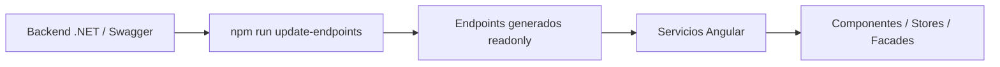

# Implementación propuesta: `update-endpoints`

## Objetivo

Implementar un comando `update-endpoints` que genere automáticamente los contratos de endpoints del frontend a partir del `swagger.json` expuesto por la API de Admisiones.

La responsabilidad de definir endpoints, parámetros, cuerpos de request y tipos de respuesta sigue siendo del backend. El frontend no debe inventar ni mantener a mano esos contratos. El frontend solamente debe consumir una representación generada y tipada de lo que publica Swagger.

La intención no es generar servicios Angular completos desde Swagger. La intención es generar archivos de endpoints y que esos endpoints sean utilizados desde los distintos servicios propios de la aplicación.

---

## Decisión de arquitectura

Se adopta la opción 2: generador propio de endpoints.

Esta opción permite mantener la arquitectura nueva del frontend, donde existen servicios de aplicación escritos a mano, pero elimina la carga manual de mantener rutas, métodos HTTP, parámetros y tipos de retorno.

El flujo esperado será:



Regla principal:

> Los endpoints generados son contrato técnico. Los servicios Angular contienen intención funcional.

Ejemplo:

- Archivo generado: define que existe `GET /api/personas/{id}` y que devuelve `PersonaResponse`.
- Servicio Angular: define el método `obtenerPersona(id)` y decide cómo se usa ese endpoint dentro del flujo de negocio del frontend.

---

## Estado actual que se debe respetar

El proyecto ya tiene un comando `update-models` que ejecuta `scripts/codegen/update-models.js`.

Ese script ya resuelve varios puntos que también deberían reutilizarse en `update-endpoints`:

- lectura del archivo de environment;
- detección del origen de la API;
- armado de la URL de Swagger;
- limpieza del directorio generado;
- ejecución desde `package.json` mediante un comando simple.

La nueva implementación debería seguir el mismo criterio para que ambos comandos sean coherentes.

---

## Resultado esperado

Agregar los siguientes comandos:

```json
{
  "scripts": {
    "update-models": "node ./scripts/codegen/update-models.js",
    "update-endpoints": "node ./scripts/codegen/update-endpoints.js",
    "update-api": "npm run update-models && npm run update-endpoints"
  }
}
```

Uso esperado por el equipo:

```bash
npm run update-api
```

Cuando cambia la API, el frontend actualiza modelos y endpoints con un único comando.

---

## Estructura propuesta

```txt
scripts/
  codegen/
    update-models.js
    update-endpoints.js

src/
  app/
    shared/
      api/
        core/
          api-endpoint.ts
          api-http-client.service.ts
          api-path-builder.ts
        endpoints/
          generated/
            admisiones.endpoints.ts
            becas.endpoints.ts
            documentos.endpoints.ts
            index.ts
        models/
          generated desde update-models
```

Si se prefiere mantener el directorio actual `src/app/shared/api-models`, se puede conservar. Lo importante es separar claramente:

- modelos generados;
- endpoints generados;
- utilidades HTTP propias del frontend;
- servicios funcionales escritos a mano.

---

## Archivos generados

Los archivos dentro de:

```txt
src/app/shared/api/endpoints/generated
```

son generados automáticamente y no deben editarse manualmente.

Cada archivo generado debe comenzar con este encabezado:

```ts
// -----------------------------------------------------------------------------
// AUTO-GENERATED FILE.
// Do not edit manually.
// Run: npm run update-endpoints
// -----------------------------------------------------------------------------
```

Además, el directorio `generated` debe limpiarse en cada ejecución para evitar endpoints obsoletos.

---

## Formato recomendado del endpoint generado

El formato recomendado es generar constantes tipadas, no clases ni servicios Angular.

Ejemplo conceptual:

```ts
import { defineEndpoint } from '../../core/api-endpoint';
import type { PersonaResponse } from '../../../api-models/personaResponse';

export const obtenerPersonaPorIdEndpoint = defineEndpoint<{
  pathParams: { id: number };
  queryParams: never;
  request: never;
  response: PersonaResponse;
}>({
  operationId: 'ObtenerPersonaPorId',
  method: 'GET',
  path: '/api/personas/{id}',
});
```

Para un endpoint con body:

```ts
import { defineEndpoint } from '../../core/api-endpoint';
import type { ReconocerDocumentoRequest } from '../../../api-models/reconocerDocumentoRequest';
import type { ReconocerDocumentoResponse } from '../../../api-models/reconocerDocumentoResponse';

export const reconocerDocumentoEndpoint = defineEndpoint<{
  pathParams: never;
  queryParams: never;
  request: ReconocerDocumentoRequest;
  response: ReconocerDocumentoResponse;
}>({
  operationId: 'ReconocerDocumento',
  method: 'POST',
  path: '/api/documentos/reconocer',
});
```

Para un endpoint con query params:

```ts
import { defineEndpoint } from '../../core/api-endpoint';
import type { BuscarPersonaResponse } from '../../../api-models/buscarPersonaResponse';

export const buscarPersonasEndpoint = defineEndpoint<{
  pathParams: never;
  queryParams: {
    documento?: string;
    email?: string;
  };
  request: never;
  response: BuscarPersonaResponse[];
}>({
  operationId: 'BuscarPersonas',
  method: 'GET',
  path: '/api/personas',
});
```

---

## Tipo base recomendado

Crear un tipo central para representar endpoints.

Archivo sugerido:

```txt
src/app/shared/api/core/api-endpoint.ts
```

Contenido conceptual:

```ts
export type ApiHttpMethod = 'GET' | 'POST' | 'PUT' | 'PATCH' | 'DELETE';

export type EndpointDefinition = {
  pathParams: unknown;
  queryParams: unknown;
  request: unknown;
  response: unknown;
};

export type ApiEndpoint<TDefinition extends EndpointDefinition> = {
  readonly operationId: string;
  readonly method: ApiHttpMethod;
  readonly path: string;
  readonly __types?: TDefinition;
};

export function defineEndpoint<TDefinition extends EndpointDefinition>(
  endpoint: Omit<ApiEndpoint<TDefinition>, '__types'>,
): ApiEndpoint<TDefinition> {
  return endpoint;
}

export type EndpointPathParams<TEndpoint> =
  TEndpoint extends ApiEndpoint<infer TDefinition> ? TDefinition['pathParams'] : never;

export type EndpointQueryParams<TEndpoint> =
  TEndpoint extends ApiEndpoint<infer TDefinition> ? TDefinition['queryParams'] : never;

export type EndpointRequest<TEndpoint> =
  TEndpoint extends ApiEndpoint<infer TDefinition> ? TDefinition['request'] : never;

export type EndpointResponse<TEndpoint> =
  TEndpoint extends ApiEndpoint<infer TDefinition> ? TDefinition['response'] : never;
```

Este formato permite que los servicios tengan tipado fuerte sin duplicar rutas ni tipos de respuesta.

---

## Cliente HTTP interno

Crear un cliente HTTP propio del frontend que sepa consumir estos endpoints.

Archivo sugerido:

```txt
src/app/shared/api/core/api-http-client.service.ts
```

Ejemplo conceptual:

```ts
import { HttpClient, HttpParams } from '@angular/common/http';
import { inject, Injectable } from '@angular/core';
import { Observable } from 'rxjs';
import { environment } from '../../../../environments/environment';
import {
  ApiEndpoint,
  EndpointPathParams,
  EndpointQueryParams,
  EndpointRequest,
  EndpointResponse,
} from './api-endpoint';
import { buildApiPath } from './api-path-builder';

export type ApiRequestOptions<TEndpoint> = {
  pathParams?: EndpointPathParams<TEndpoint>;
  queryParams?: EndpointQueryParams<TEndpoint>;
  body?: EndpointRequest<TEndpoint>;
};

@Injectable({ providedIn: 'root' })
export class ApiHttpClient {
  private readonly http = inject(HttpClient);
  private readonly apiBaseUrl = environment.apiBaseUrl;

  request<TEndpoint extends ApiEndpoint<any>>(
    endpoint: TEndpoint,
    options: ApiRequestOptions<TEndpoint> = {},
  ): Observable<EndpointResponse<TEndpoint>> {
    const url = `${this.apiBaseUrl}${buildApiPath(endpoint.path, options.pathParams)}`;
    const params = this.buildHttpParams(options.queryParams);

    switch (endpoint.method) {
      case 'GET':
        return this.http.get<EndpointResponse<TEndpoint>>(url, { params });
      case 'POST':
        return this.http.post<EndpointResponse<TEndpoint>>(url, options.body, { params });
      case 'PUT':
        return this.http.put<EndpointResponse<TEndpoint>>(url, options.body, { params });
      case 'PATCH':
        return this.http.patch<EndpointResponse<TEndpoint>>(url, options.body, { params });
      case 'DELETE':
        return this.http.delete<EndpointResponse<TEndpoint>>(url, { params });
    }
  }

  private buildHttpParams(queryParams: unknown): HttpParams | undefined {
    if (!queryParams || typeof queryParams !== 'object') {
      return undefined;
    }

    return Object.entries(queryParams).reduce((params, [key, value]) => {
      if (value === undefined || value === null) {
        return params;
      }

      return params.set(key, String(value));
    }, new HttpParams());
  }
}
```

Este cliente centraliza la forma de ejecutar endpoints, pero no reemplaza los servicios funcionales de la aplicación.

---

## Armado de rutas con parámetros

Archivo sugerido:

```txt
src/app/shared/api/core/api-path-builder.ts
```

Ejemplo conceptual:

```ts
export function buildApiPath(
  path: string,
  pathParams: unknown,
): string {
  if (!pathParams || typeof pathParams !== 'object') {
    return path;
  }

  return Object.entries(pathParams).reduce(
    (currentPath, [key, value]) =>
      currentPath.replace(`{${key}}`, encodeURIComponent(String(value))),
    path,
  );
}
```

El script debe generar los `pathParams` según los parámetros `in: path` definidos en Swagger.

---

## Uso desde servicios Angular

Los servicios de la aplicación siguen siendo escritos a mano.

Ejemplo:

```ts
import { inject, Injectable } from '@angular/core';
import { Observable } from 'rxjs';
import { ApiHttpClient } from '../../shared/api/core/api-http-client.service';
import { obtenerPersonaPorIdEndpoint } from '../../shared/api/endpoints/generated/personas.endpoints';
import type { PersonaResponse } from '../../shared/api-models/personaResponse';

@Injectable({ providedIn: 'root' })
export class PersonasService {
  private readonly api = inject(ApiHttpClient);

  obtenerPersona(id: number): Observable<PersonaResponse> {
    return this.api.request(obtenerPersonaPorIdEndpoint, {
      pathParams: { id },
    });
  }
}
```

Ejemplo con request body:

```ts
import { inject, Injectable } from '@angular/core';
import { Observable } from 'rxjs';
import { ApiHttpClient } from '../../shared/api/core/api-http-client.service';
import { reconocerDocumentoEndpoint } from '../../shared/api/endpoints/generated/documentos.endpoints';
import type { ReconocerDocumentoRequest } from '../../shared/api-models/reconocerDocumentoRequest';
import type { ReconocerDocumentoResponse } from '../../shared/api-models/reconocerDocumentoResponse';

@Injectable({ providedIn: 'root' })
export class ReconocimientoDocumentoService {
  private readonly api = inject(ApiHttpClient);

  reconocerDocumento(
    request: ReconocerDocumentoRequest,
  ): Observable<ReconocerDocumentoResponse> {
    return this.api.request(reconocerDocumentoEndpoint, {
      body: request,
    });
  }
}
```

Ventaja de este enfoque:

- los servicios mantienen nombres funcionales;
- el contrato técnico viene de Swagger;
- no se duplican rutas;
- no se escriben manualmente tipos de respuesta;
- los componentes no conocen rutas ni métodos HTTP;
- los cambios de backend se detectan al regenerar.

---

## Criterio Angular 2026

Para esta implementación se recomienda:

- usar servicios `@Injectable({ providedIn: 'root' })` para clientes compartidos;
- usar `inject()` para dependencias dentro de servicios y clases Angular;
- configurar `HttpClient` con `provideHttpClient()` en la configuración de la aplicación;
- centralizar autenticación, headers, errores, logging y loading global mediante interceptores funcionales;
- mantener los servicios de dominio como capa de intención funcional;
- evitar que los componentes llamen directamente a `HttpClient`;
- evitar que los componentes importen endpoints generados;
- devolver `Observable` desde los servicios HTTP;
- usar Signals en componentes, stores o facades cuando aplique, pero no como reemplazo directo del contrato HTTP generado.

Motivo: los endpoints generados son una capa de contrato. El estado visual, la carga, la composición de datos y la experiencia de usuario pertenecen a capas superiores.

---

## Implementación de `update-endpoints.js`

El script debe vivir en:

```txt
scripts/codegen/update-endpoints.js
```

Responsabilidades:

1. Leer argumentos de consola.
2. Leer el environment indicado.
3. Detectar el origen de la API.
4. Descargar el `swagger.json`.
5. Recorrer `paths`.
6. Por cada operación HTTP:
   - obtener `operationId`;
   - obtener `tags`;
   - obtener método HTTP;
   - obtener path;
   - obtener parámetros `path`;
   - obtener parámetros `query`;
   - obtener tipo de request body;
   - obtener tipo de response principal;
   - generar nombre de constante;
   - agregar imports de modelos.
7. Agrupar endpoints por tag o controller.
8. Limpiar el directorio generado.
9. Escribir archivos `.endpoints.ts`.
10. Escribir `index.ts`.

Comando esperado:

```bash
npm run update-endpoints
```

Opciones recomendadas:

```bash
node scripts/codegen/update-endpoints.js \
  --env environment.ts \
  --swagger-path /swagger/v1/swagger.json \
  --output src/app/shared/api/endpoints/generated
```

---

## Reglas para nombres generados

Orden sugerido:

1. Si Swagger trae `operationId`, usarlo como fuente principal.
2. Convertir `operationId` a camelCase.
3. Agregar sufijo `Endpoint`.
4. Si no existe `operationId`, construir nombre desde método + path.
5. Si hay colisión, fallar el script en vez de generar nombres ambiguos.

Ejemplos:

```txt
ObtenerPersonaPorId       -> obtenerPersonaPorIdEndpoint
ReconocerDocumento        -> reconocerDocumentoEndpoint
BuscarInscripciones       -> buscarInscripcionesEndpoint
```

No se recomienda generar nombres basados solamente en el path porque son menos estables ante cambios de ruta.

---

## Reglas para agrupar archivos

Orden sugerido:

1. Usar el primer `tag` de Swagger.
2. Si no hay tag, usar `general`.
3. Normalizar el nombre a kebab-case.
4. Generar un archivo por tag.

Ejemplo:

```txt
Documentos              -> documentos.endpoints.ts
ReconocimientoDocumentos -> reconocimiento-documentos.endpoints.ts
Becas                   -> becas.endpoints.ts
```

Esto mantiene los archivos chicos, navegables y alineados con la organización funcional del backend.

---

## Reglas para responses

Para cada endpoint se debe tomar como response principal:

1. `200`, si existe;
2. `201`, si existe;
3. `204`, si existe;
4. primer código `2xx` disponible;
5. si no hay `2xx`, usar `unknown` y mostrar warning.

Para `204 No Content`, el tipo de response debería ser `void`.

Los errores HTTP no deberían modelarse como retorno normal del endpoint. Se recomienda manejarlos de forma centralizada mediante interceptores o servicios de error.

---

## Reglas para request body

Para métodos `POST`, `PUT` y `PATCH`, el script debe intentar resolver el schema del `requestBody`.

Si el endpoint no tiene body, usar:

```ts
request: never;
```

Si el body existe pero Swagger no permite resolver el schema, usar:

```ts
request: unknown;
```

y mostrar un warning para que el backend revise la documentación Swagger.

---

## Reglas para parámetros

Los parámetros `in: path` deben ir en `pathParams`.

Los parámetros `in: query` deben ir en `queryParams`.

Los parámetros `in: header` no deberían generarse como parte normal del endpoint. En general, headers transversales como autorización, canal, correlación, idioma o trazabilidad deben resolverse con interceptores.

Ejemplo:

```ts
export const buscarPersonasEndpoint = defineEndpoint<{
  pathParams: never;
  queryParams: {
    documento?: string;
    email?: string;
  };
  request: never;
  response: PersonaResponse[];
}>({
  operationId: 'BuscarPersonas',
  method: 'GET',
  path: '/api/personas',
});
```

---

## Control de edición manual

Aunque Git no bloquea de forma simple la edición de archivos específicos para todos los casos, se debe controlar con proceso y CI.

Agregar validación en pipeline:

```bash
npm run update-api
git diff --exit-code
```

Resultado esperado:

- si los endpoints están actualizados, no hay diferencias;
- si alguien editó a mano un archivo generado, el script lo pisa y el diff falla;
- si cambió Swagger y no se regeneró, el pipeline falla;
- si el backend cambió el contrato, el frontend lo detecta temprano.

También se puede reforzar con una regla de revisión:

> Los PR no deben modificar manualmente archivos dentro de `src/app/shared/api/endpoints/generated`. Toda modificación debe provenir de `npm run update-endpoints`.

---

## Qué no debería hacer esta implementación

No debería:

- generar servicios Angular funcionales por cada controller;
- reemplazar los servicios de dominio existentes;
- hacer que los componentes llamen endpoints generados directamente;
- duplicar modelos que ya genera `update-models`;
- permitir rutas escritas a mano en servicios cuando existe endpoint generado;
- mezclar lógica de negocio dentro del cliente HTTP genérico;
- resolver reglas de autorización en cada endpoint individual.

---

## Responsabilidad del backend

Para que este flujo funcione bien, el backend debe publicar Swagger con buena calidad.

Requisitos mínimos:

- `operationId` estable y único por endpoint;
- `tags` coherentes;
- parámetros `path` y `query` correctamente definidos;
- request body correctamente tipado;
- response principal correctamente tipada;
- no usar `object` si existe un DTO concreto;
- no devolver schemas ambiguos si el frontend necesita tipado fuerte.

Si Swagger está incompleto, el frontend no debería corregirlo manualmente. La corrección debe hacerse en el backend.

---

## Responsabilidad del frontend

El frontend debe:

- ejecutar `npm run update-api` cuando cambia la API;
- consumir endpoints generados desde servicios Angular;
- mantener lógica funcional dentro de servicios propios;
- no editar archivos generados;
- mantener un cliente HTTP centralizado;
- usar interceptores para concerns transversales;
- validar en CI que modelos y endpoints estén actualizados.

---

## Ejemplo de flujo de trabajo

Cuando el backend agrega o modifica un endpoint:

1. Backend actualiza controller, DTOs y Swagger.
2. Frontend ejecuta:

```bash
npm run update-api
```

3. Se regeneran modelos.
4. Se regeneran endpoints.
5. El desarrollador usa el endpoint generado dentro del servicio Angular correspondiente.
6. Si cambió un contrato, TypeScript marca los lugares que deben ajustarse.
7. El PR incluye los archivos generados y los cambios funcionales necesarios.
8. CI valida que no haya diferencias pendientes.

---

## Ejemplo de PR esperado

Un PR correcto podría incluir:

```txt
scripts/codegen/update-endpoints.js
src/app/shared/api/core/api-endpoint.ts
src/app/shared/api/core/api-http-client.service.ts
src/app/shared/api/core/api-path-builder.ts
src/app/shared/api/endpoints/generated/documentos.endpoints.ts
src/app/features/documentos/services/reconocimiento-documento.service.ts
package.json
```

Un PR incorrecto sería:

```txt
src/app/shared/api/endpoints/generated/documentos.endpoints.ts editado manualmente
src/app/features/documentos/components/documento.component.ts llamando directo a HttpClient
```

---

## Criterios de aceptación

La implementación se considera correcta cuando:

- existe el comando `npm run update-endpoints`;
- existe el comando `npm run update-api`;
- los endpoints se generan desde Swagger;
- los archivos generados tienen encabezado de advertencia;
- los endpoints generados incluyen método, path, path params, query params, request y response;
- los servicios Angular consumen endpoints generados;
- los componentes no consumen endpoints generados directamente;
- el script falla ante colisiones de nombres;
- el script muestra warnings ante schemas ambiguos;
- CI detecta si los endpoints generados están desactualizados;
- no se duplica la generación de modelos ya existente.

---

## Referencias técnicas

- Angular HTTP Client: https://angular.dev/guide/http
- Configuración moderna de HttpClient con `provideHttpClient`: https://angular.dev/guide/http/setup
- Requests tipados con `HttpClient`: https://angular.dev/guide/http/making-requests
- Interceptores funcionales: https://angular.dev/guide/http/interceptors
- Dependency Injection y servicios Angular: https://angular.dev/guide/di
- OpenAPI Generator global properties: https://openapi-generator.tech/docs/globals/
