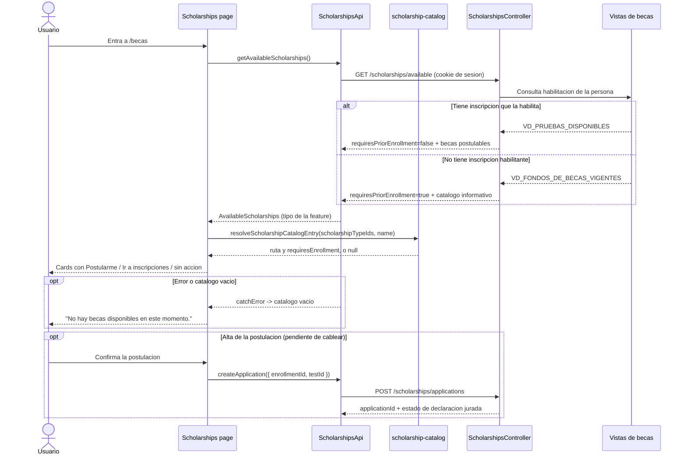

import SourceLink from '@site/src/components/SourceLink';

# Postulacion a becas

> Tipo: explanation

Este documento cubre la pantalla `/becas`: de donde salen las becas que se listan, quien decide si la persona puede postularse y como se une la respuesta del backend con la navegacion del front. El proceso paso a paso de cada beca (onboarding, datos academicos, datos personales, confirmacion) se documenta aparte; aca termina en el momento en que la persona toca **Postularme**.

## Recorrido completo

## Acciones y referencias

| Accion visible                | Angular                                                       | Servicio                           | Adapter y contrato                                  | API / Backend                     |
| ----------------------------- | ------------------------------------------------------------- | ---------------------------------- | --------------------------------------------------- | --------------------------------- |
| Ver el catalogo de becas      | `Scholarships` en `pages/scholarships/scholarships.ts`        | La page inyecta el adapter directo | `ScholarshipsApi.getAvailableScholarships()`        | `GET /scholarships/available`     |
| Saber si puede postularse     | `Scholarships.isEnrolled` (niega `requiresPriorEnrollment`)   | —                                  | Mismo endpoint: el backend responde la habilitacion | `GET /scholarships/available`     |
| Saber a donde lleva una card  | `resolveScholarshipCatalogEntry()` en `models/`               | —                                  | No viaja por HTTP: es conocimiento del front        | —                                 |
| Ir al proceso de una beca     | `ScholarshipCard` con `routerLink` a `/becas/{kind}`          | —                                  | `scholarships.routes.ts` pasa `data.kind`           | —                                 |
| Ir a inscripciones            | `ScholarshipCard`, rama `requiresEnrollment` sin habilitacion | —                                  | —                                                   | —                                 |
| Ver inscripciones confirmadas | Sin consumidor en esta pantalla                               | —                                  | `ScholarshipsApi.getConfirmedEnrollments()`         | `GET /scholarships/enrollments`   |
| Dar de alta la postulacion    | Pendiente: `facades/scholarship-proposal.ts`                  | —                                  | `ScholarshipsApi.createApplication()`               | `POST /scholarships/applications` |

## Estados, contratos y sesiones

La persona sale del token, no de la URL: `/scholarships/available` no recibe parametros. La UI usa tipos propios de la feature (`AvailableScholarships`, `ScholarshipCardModel`); `ScholarshipsApi` es la unica capa de becas que importa endpoints generados.

| Estado                              | Origen                                       | Frontend                                           | Efecto                                                   |
| ----------------------------------- | -------------------------------------------- | -------------------------------------------------- | -------------------------------------------------------- |
| `requiresPriorEnrollment: false`    | Vista de pruebas disponibles                 | `isEnrolled()` es `true`                           | Todas las cards muestran **Postularme**                  |
| `requiresPriorEnrollment: true`     | Vista de fondos vigentes                     | `isEnrolled()` es `false`                          | Solo las becas sin inscripcion previa quedan postulables |
| Card con `scholarshipTypeIds` nuevo | Fondo que el front todavia no tiene pantalla | `resolveScholarshipCatalogEntry()` devuelve `null` | La card se muestra sin accion, no se esconde             |
| `scholarships: []`                  | No hay fondos vigentes                       | `hasScholarships()` es `false`                     | Mensaje de catalogo vacio                                |
| Endpoint caido                      | Error HTTP                                   | `catchError` cae al catalogo vacio restrictivo     | Pantalla utilizable, sin ofrecer postulaciones           |

El texto de las cards (`name`, `description`, `requiresTest`) es **siempre** del backend. La ruta y el gating por inscripcion son del front, en <SourceLink repo="frontend" path="src/app/features/scholarships/models/scholarship-catalog.ts">`scholarship-catalog.ts`</SourceLink>: el backend no conoce las rutas de Angular.

Una card **no es un fondo**: es un `NOMBRE_PARA_FRONT` que puede agrupar varios `ID_TIPO_BECA`. Excelencia Academica son dos fondos (33 sin declaracion jurada, 57 con) y se muestran como una sola card. Por eso `scholarshipTypeIds` es un array.

## Validaciones y seguridad

- El endpoint es privado: viaja con las cookies HttpOnly de sesion y la ruta `/becas` esta detras del guard de autenticacion (ver [Login](./login.md)).
- El frontend **no decide** si alguien puede postularse: ese juicio es `requiresPriorEnrollment`. La UI solo lo refleja.
- Ante ausencia de datos se asume el caso restrictivo (`requiresPriorEnrollment: true`): un backend caido nunca habilita una postulacion.
- El `testId` que exige `POST /scholarships/applications` no se calcula en el front: sale de filtrar `tests[]` de `GET /scholarships/application-options` por el `scholarshipTypeId` de la modalidad y el `intakeId` de la inscripcion.

## Casos borde

- **`ID_TIPO_BECA` sin confirmar.** El contrato solo publica los ids de Excelencia Academica (33 y 57). Los de revalidas, concursables y capacitacion laboral estan pendientes de backend, asi que `scholarship-catalog.ts` los resuelve por palabra clave del `name` como respaldo temporal. Ese fallback se borra en cuanto lleguen los ids.
- **Fondo nuevo que el front no conoce.** Se renderiza con el texto del backend y sin boton: esconder un fondo vigente es peor que ofrecerlo sin accion.
- **Descripciones vacias.** Salen de `AppLogic.Scholarships/Rules/ScholarshipDescriptions`, keyeadas por `ID_TIPO_BECA`, con fallback a la columna de base. Un fondo nuevo sin entrada llega con `description` vacio y sin error; es deuda declarada del backend.
- **Una sola fecha de prueba.** La vista de pruebas disponibles filtra por el dia de cierre mas proximo de cada fondo, asi que `tests[]` puede traer una sola opcion aunque el fondo tenga mas pruebas vigentes. El contrato ya soporta N: cuando se relaje la vista, el front no cambia.
- **`tests[]` vacio** significa que el fondo no se rinde, no que falten datos.
- **No hay flag de "ya postulada".** El backend no informa si la persona ya se postulo a un fondo; la card se ofrece igual.

## Fuentes vigentes

- Contrato de negocio: `.api-spec/contracts/becas.contract.json` — es la autoridad de estas pantallas y explica las vistas de base detras de cada rama.
- Frontend: <SourceLink repo="frontend" path="src/app/features/scholarships/pages/scholarships/scholarships.ts">page de becas</SourceLink>, <SourceLink repo="frontend" path="src/app/features/scholarships/api/scholarships.api.ts">HTTP adapter</SourceLink> y <SourceLink repo="frontend" path="src/app/features/scholarships/README.md">README de la feature</SourceLink>.
- Backend: <SourceLink repo="backend" path="WebApiAdmisiones/WebApiAdmisiones/Controllers/ScholarshipsController.cs">ScholarshipsController</SourceLink> y <SourceLink repo="backend" path="WebApiAdmisiones/AppLogic/Scholarships/">modulo Scholarships</SourceLink>.

## Evidencia

- Frontend:
  - `src/app/features/scholarships/api/scholarships.api.spec.ts`
  - `src/app/features/scholarships/models/scholarship-catalog.spec.ts`
  - `src/app/features/scholarships/pages/scholarships/scholarships.spec.ts`
  - `src/app/features/scholarships/components/scholarship-card/scholarship-card.spec.ts`
  - `e2e/scholarships.spec.ts`
- Backend:
  - El contrato publico se publica por OpenAPI y se regenera en frontend con `npm run update-api`.

Errores declarados por el contrato para el resto del flujo: `BEC_PO_01` y `BEC_PO_02` (opciones de postulacion) y `ALTA_POSTULACION_BECA_01` (alta). `GET /scholarships/available` no declara errores funcionales.
