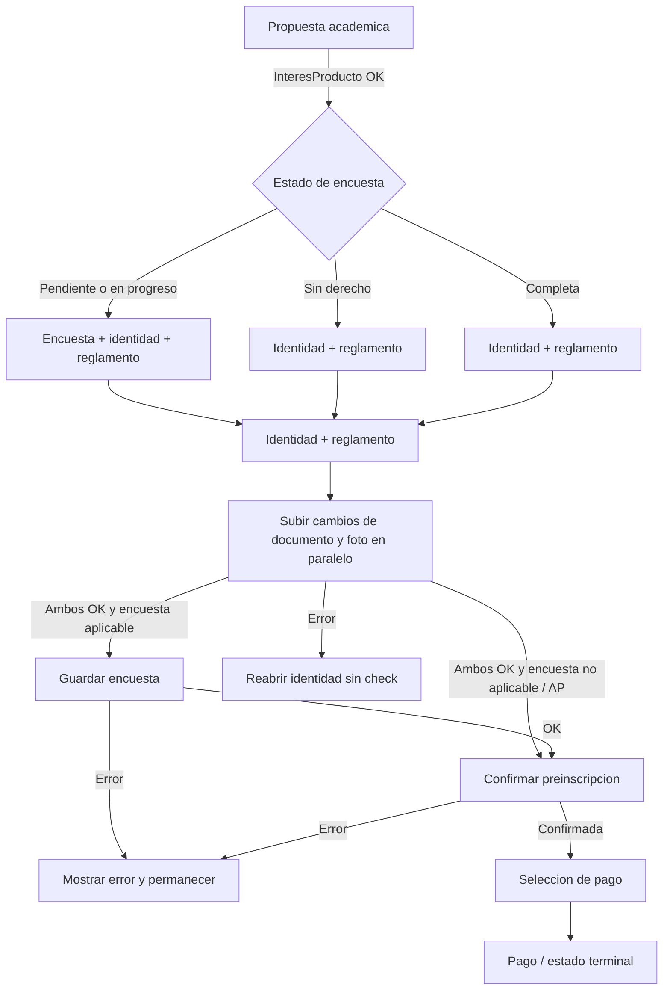
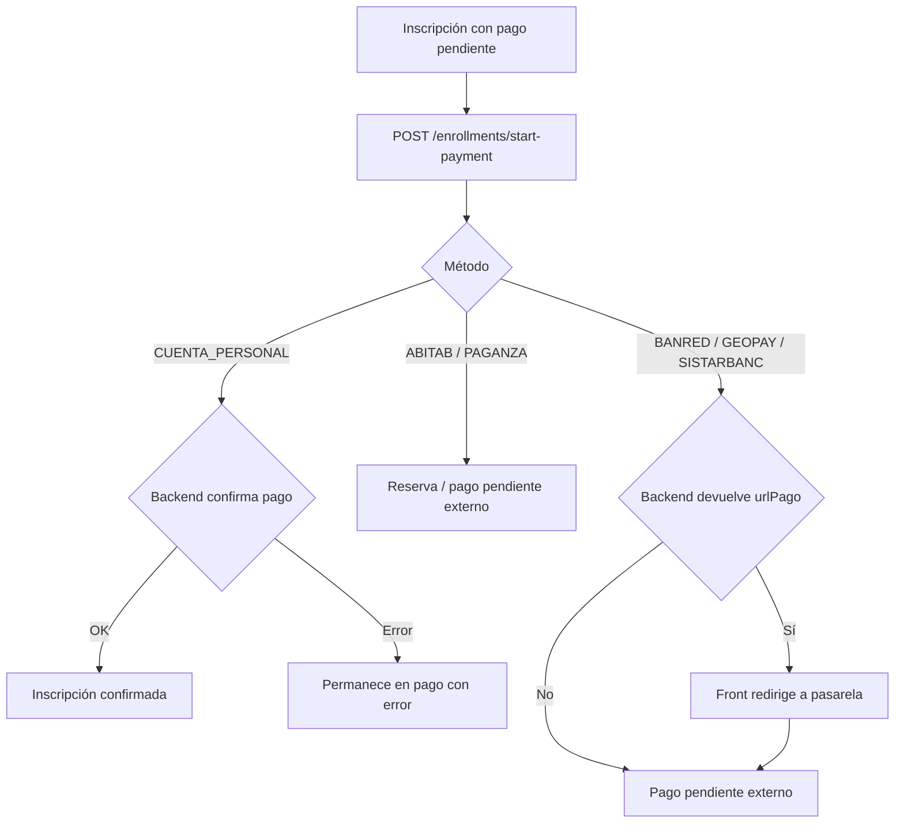

import SourceLink from '@site/src/components/SourceLink';

# Inscripciones de punta a punta

> Tipo: reference

Fuentes de verdad: `src/app/features/inscriptions/**` y
`api-admisiones/WebApiAdmisiones/AppLogic/AppLogic.Enrollments/**`. Este documento
describe el comportamiento desplegado del frontend y del backend conectado a esta
rama: entrada desde el dashboard, encuesta, identidad, confirmación, reactivación,
pago, persistencia e integraciones. No uses el raw value de los formularios como
contrato: el payload HTTP sale de `inscription-flow-mappers.ts` y OpenAPI es la
autoridad del wire contract.

## Acciones y evidencia end-to-end

| Acción visible               | Frontend                                                                                                                                                                                                                                                           | HTTP                                                                   | Backend                                                                                                                                                                                                                                                |
| ---------------------------- | ------------------------------------------------------------------------------------------------------------------------------------------------------------------------------------------------------------------------------------------------------------------ | ---------------------------------------------------------------------- | ------------------------------------------------------------------------------------------------------------------------------------------------------------------------------------------------------------------------------------------------------ |
| Cargar Mis carreras          | <SourceLink repo="frontend" path="src/app/features/home/endpoints/home.endpoint.ts">HomeEndpoint</SourceLink>                                                                                                                                                      | `GET /person/enrollments`                                              | <SourceLink repo="backend" path="WebApiAdmisiones/AppLogic/AppLogic.People/UseCases/GetMyEnrollments.cs">GetMyEnrollments</SourceLink> → vistas Fresco 1/2 y 3/4                                                                                       |
| Continuar propuesta          | <SourceLink repo="frontend" path="src/app/features/inscriptions/facades/inscription-proposal.ts">InscriptionProposalFacade</SourceLink> → <SourceLink repo="frontend" path="src/app/features/inscriptions/endpoints/inscriptions.endpoint.ts">adapter</SourceLink> | `POST /enrollments/product-interest`                                   | <SourceLink repo="backend" path="WebApiAdmisiones/AppLogic/AppLogic.Enrollments/UseCases/RegisterProductInterest.cs">RegisterProductInterest</SourceLink> → Oracle + cola Tivenos                                                                      |
| Confirmar datos personales   | <SourceLink repo="frontend" path="src/app/features/inscriptions/facades/inscription-survey.ts">InscriptionSurveyFacade</SourceLink> → adapter                                                                                                                      | Documento/foto → encuesta → `POST /enrollments/confirm-pre-enrollment` | <SourceLink repo="backend" path="WebApiAdmisiones/AppLogic/AppLogic.People/">People</SourceLink> + <SourceLink repo="backend" path="WebApiAdmisiones/AppLogic/AppLogic.Enrollments/UseCases/ConfirmPreEnrollment.cs">ConfirmPreEnrollment</SourceLink> |
| Elegir forma de pago         | <SourceLink repo="frontend" path="src/app/features/inscriptions/facades/inscription-payment.ts">InscriptionPaymentFacade</SourceLink> → adapter                                                                                                                    | `POST /enrollments/start-payment`                                      | <SourceLink repo="backend" path="WebApiAdmisiones/AppLogic/AppLogic.Enrollments/UseCases/Payments/StartEnrollmentPayment.cs">StartEnrollmentPayment</SourceLink> → API interna de Inscripciones y Pagos                                                |
| Reactivar desde Mis carreras | <SourceLink repo="frontend" path="src/app/features/home/components/dashboard-quick-actions/dashboard-quick-actions.ts">DashboardQuickActions</SourceLink>                                                                                                          | `POST /enrollments/reactivate`                                         | <SourceLink repo="backend" path="WebApiAdmisiones/AppLogic/AppLogic.Enrollments/UseCases/ReactivateEnrollment.cs">ReactivateEnrollment</SourceLink> → `ConfirmPreEnrollment`                                                                           |

Las rutas y shapes HTTP son autoridad de OpenAPI. Las reglas internas del servidor viven en el backend; si una evidencia contradice esta página, registrar un bloque **Drift detectado** hasta alinear ambos repositorios.

## Límites y componentes

- Todos los endpoints de `person`, `enrollments` y `catalogs` usados aquí requieren
  la identidad del usuario autenticado. El backend obtiene `personId` del JWT/cookie;
  nunca acepta la persona desde el request.
- `InscripcionesEndpoint` es la frontera anticorrupción del front: traduce los modelos
  generados en inglés a tipos propios de la feature. No hay caché HTTP que invalidar:
  `ApiHttpClient` manda cada request a la red, así que detalle, identidad, encuesta y
  reglamento siempre leen el estado vigente.
- Oracle persiste interés, encuesta, aceptación del reglamento, imágenes, inscripciones
  y método de reserva. La cola de Tivenos se registra en la misma transacción que el
  interés o la actualización de bachillerato; la entrega efectiva ocurre fuera del
  request.
- La API interna de **Inscripciones y Pagos** confirma preinscripciones, consulta
  carritos, cobra cuenta personal y genera URLs de pasarela. Su handler agrega las
  credenciales de servicio. Admisiones traduce fallos de red a `API_NETWORK`/503,
  timeout mayor a dos minutos a `API_TIMEOUT`/504 y fallos inesperados a
  `API_UNEXPECTED`/500.
- La inscripción corporativa no llama a la API de pagos: crea un trámite de bandeja por
  oferta, con vencimiento a cinco días, y devuelve `waiting = true`.

## Pasos y escenarios

El flujo tiene 3 pasos. El **paso 1** (Propuesta académica) avanza con
`POST /enrollments/product-interest`. El **paso 2** (Informacion personal)
guarda primero los cambios de identidad, luego llama a
`POST /enrollments/initial-survey` cuando corresponde y finalmente a
`POST /enrollments/confirm-pre-enrollment`. El **paso 3** (Confirmacion /
pago) llama a `POST /enrollments/start-payment`; el detalle operativo forma parte de esta misma página.

Antes de entrar al paso 2 se consulta `GET /enrollments/initial-survey`.
Si el usuario no tiene encuesta o la tiene en progreso, se muestran las
secciones de Educacion, decision academica, experiencia ORT, situacion
laboral, identidad y reglamento. Si `tieneDerechoEncuesta === false`, solo
se muestran identidad y reglamento, salvo en Actualización profesional, donde
también se pregunta si la inscripción es corporativa. Si la encuesta ya viene
completa no se muestran secciones de encuesta, con la misma excepción para AP.



Las cargas de identidad son condicionales: un archivo precargado y no modificado no se
vuelve a enviar. AP nunca guarda encuesta. Para niveles 1/2, el `POST initial-survey`
es un upsert parcial que queda `temporal` mientras falten respuestas y pasa a
`definitivo` cuando la validación sobre lo persistido no encuentra pendientes.

## Intención de entrada × estado × encuesta

Cómo arranca el flujo depende de la **intención de entrada** (decidida por la URL,
no por el backend) combinada con el estado de la inscripción (`Detalle` o respuesta
de `Reactivar`) y el de la
encuesta inicial (`EncuestaInicial`, que es **por persona**). La derivación es pura
y está fijada por la tabla ejecutable `models/inscription-entry.spec.ts`; esta
matriz es su lectura de negocio.

- **Nueva** (`/inscripciones`, sin params): el Paso 1 arranca **siempre virgen y
  editable**, aunque exista una encuesta previa en progreso. La encuesta previa solo
  se reutiliza al llegar al Paso 2 (prellena respuestas), nunca precarga el Paso 1 ni
  reposiciona el flujo. `InteresProducto` se envía al continuar.
- **Retomar** (`/inscripciones?idProducto=X&idProceso=Y`, desde el panel):
  llegar con producto y proceso válidos **ya prueba que la inscripción existe**, así
  que el interés está registrado y el **Paso 1 nunca se muestra**. Al hacer clic en
  "Continuar inscripción", la tarjeta guarda sus `idOferta` e `idInscripcion` en
  `sessionStorage`; la URL conserva producto, proceso, `estado` y `nivel`. El Paso 1 queda precargado y
  deshabilitado (no se vuelve a enviar `InteresProducto`) y el flujo arranca en el Paso
  2 o en la pantalla que corresponda al estado.

  | Estado del detalle                  | Dónde arranca / qué muestra                 |
  | ----------------------------------- | ------------------------------------------- |
  | En proceso (con o sin encuesta)     | Paso 2 (sección activa de la encuesta)      |
  | `Detalle` caído / sin estado útil   | Paso 2 con la precarga mínima de los params |
  | Pago pendiente / Pendiente sin seña | Paso 3 (elegir medio de pago)               |
  | Pago pendiente / Pendiente con seña | Pantalla de referencias de pago (reserva)   |
  | Confirmada                          | Pantalla de éxito terminal                  |
  | A la espera / desconocido           | Pantalla "Inscripción en proceso"           |

  En ambas filas, si el monto de la seña es `0`, el flujo omite la selección de pago y
  muestra directamente la pantalla con el mensaje de contacto a oficina (ver "Estados frontend").

  Los estados terminales pintan su pantalla por `payment` y dejan el flujo en el Paso 3:
  así el Paso 1 no es el paso corriente en ninguna combinación. Solo params **inválidos**
  (faltantes, no numéricos, ≤ 0) degradan a **nueva**, porque sin ellos no hay
  inscripción que retomar.

  **Precarga del Paso 1 al retomar.** Producto y proceso salen de la URL/Detalle; las
  ofertas salen del contexto guardado por la tarjeta en `sessionStorage`. Un enlace de
  Detalle que incluya `idOferta` explícitos mantiene precedencia; si ninguna de esas
  fuentes existe, `detalle.intereses` aporta el fallback
  (una oferta por seminario en Actualización profesional). El
  contrato del `Detalle` **no expone `idComienzo` ni `idTurno`** en ningún bloque, así
  que el comienzo y el turno solo llegan como texto; por eso la precarga llena
  `turno` y `seminarios` con los `idOferta` (el payload de `ConfirmarPreInscripcion`
  lee uno u otro según el tipo de propuesta) y toma el comienzo del param `idProceso`
  (el control `comienzo` guarda justamente un idProceso). Si el `Detalle` no llegó,
  los params conservan producto, proceso y ofertas, por lo que el Paso 2 puede confirmar
  igualmente. La
  selección académica de una encuesta previa nunca se aplica al Paso 1 al retomar. Si el
  catálogo de carreras falla y el nivel queda `null`, el tipo de propuesta se completa
  después desde el nivel de la carrera (`AcademicProposalSelection`).

  **Pago y resumen al retomar AP.** La respuesta de
  `ConfirmarPreInscripcion.inscripciones` es la fuente principal de los IDs a cobrar y
  de las filas del resumen. Si esa respuesta no trae el bloque, `Pagar` usa como
  fallback los `idInscripcion` guardados en sesión, y el resumen usa los seminarios
  seleccionados del catálogo. El contexto se valida contra producto/proceso y conserva
  solo enteros positivos sin duplicados; el backend mantiene la validación final de pertenencia.

- **El flujo solo avanza.** Pasar de paso es un hecho ya registrado en el backend
  (Paso 1 ⇒ `InteresProducto`, Paso 2 ⇒ `ConfirmarPreInscripcion`), así que **no hay
  vuelta atrás entre pasos**: no se vuelve del Paso 2 al 1 ni del Paso 3 al 2. Lo único
  que retrocede es la navegación **dentro** del Paso 2 (secciones de la encuesta y
  lector de reglamento), y el botón de volver solo aparece cuando hay algo hacia atrás.
  Los pasos no están en la URL, así que la flecha del navegador no vuelve un paso: sale
  del flujo, y al reingresar el estado se vuelve a derivar del backend.

- **Reactivar** (`/inscripciones?idProducto=X&idProceso=Y&modo=reactivar`): el botón
  del dashboard hace `POST /enrollments/reactivate` con **todas** las anotaciones de
  la tarjeta en `enrollmentIds` (una en niveles 1/2; una por seminario en los paquetes
  de Actualización profesional, que se dan de baja y se reactivan en bloque), y
  devuelve el mismo contrato que `ConfirmarPreInscripcion`. El frontend conserva transitoriamente esa respuesta y
  los IDs de las nuevas inscripciones: `enEspera` muestra la pantalla informativa,
  seña `0` muestra la reserva y el resto abre la selección de pago. El resolver no
  llama a `GET /enrollments/details` en esta navegación; si la respuesta ya no está
  disponible por recarga o acceso directo, usa `Detalle` como fallback. Los
  `getDetail` posteriores a `Pagar` se mantienen para completar coordinación, materias
  o referencias de reserva que el POST de reactivación no devuelve.

  El backend verifica **todo o nada** que cada ID pertenezca a la persona, esté dado de
  baja y tenga oferta; deduplica ofertas y delega en la confirmación normal. No marca la
  baja original como “ya reactivada” ni usa clave de idempotencia, por lo que una
  repetición incierta debe resolverse consultando el estado antes de reintentar.

### Detalle como read model

`GET /enrollments/details?productId=X&admissionProcessId=Y&status=Z` busca primero la
vista Fresco 1/2 y luego 3/4. Devuelve `INS_DET_01`/404 si no encuentra estado y
completa solo el bloque correspondiente:

`status` es el `enrollmentStatus` que ya devuelve `GET /person/enrollments`; se agregó
porque `productId` + `admissionProcessId` dejaron de identificar una única inscripción
cuando la persona tiene más de una tarjeta con ese mismo par (por ejemplo, una
inscripción confirmada y una reactivación posterior del mismo producto/proceso). El
front lo manda siempre que lo conoce, pero el param sigue siendo opcional: un link
viejo sin `estado` se llama sin `status` y el backend resuelve como antes. El frontend
lo propaga por el query param `estado` en la URL de `/inscripciones` (mismo mecanismo
que `idProducto`/`idProceso`/`modo`), leído por `inscriptionDetailResolver` y por
`InscripcionPaymentFacade` al retomar el pago desde el panel.

`nivel` viaja por el mismo mecanismo y con la misma regla de opcionalidad: es el
`productLevelId` que ya devuelve `GET /person/enrollments`, y existe para que el
resolver no reconstruya el nivel del producto consultando los tres tipos de propuesta.
No se envía al backend: solo alimenta `idNivelProducto` del read model de entrada. El
resolver lo descarta si no corresponde a un tipo conocido y cae al catálogo, así que un
valor manipulado no puede hacer más que elegir la rama de UI equivocada; la pertenencia
de los IDs la revalida el backend igual que siempre.

| Estado                               | Bloque                                                       | Fuente               |
| ------------------------------------ | ------------------------------------------------------------ | -------------------- |
| `En proceso`                         | `inProgress` con intereses/ofertas                           | Oracle               |
| `A la espera` o desconocido          | solo `status`                                                | Oracle               |
| `Pago pendiente`, sin método         | `pendingPayment` con carritos, saldo, seña y vencimiento     | Oracle + API interna |
| `Pago pendiente`, con Abitab/Paganza | `minimumDeposit` con método, documento, persona y seña total | Oracle + API interna |
| `Confirmada`                         | `confirmed` con persona, coordinadores y materias por oferta | Oracle               |

Si falla la consulta de carritos, el detalle propaga el error de la API interna; no
degrada silenciosamente a un bloque incompleto. El front, en cambio, captura el error
del resolver al retomar y abre el paso 2 con los IDs de la URL/contexto.

## Regla general de valores ocultos

Cuando un campo padre cambia, la UI actualiza validadores y puede ocultar
campos hijos. En varios casos el valor crudo del hijo queda en el form, pero
el payload lo ignora y envia `null` cuando el padre indica que no aplica.

Excepciones que si limpian valores:

- Propuesta academica: cambiar `tipoPropuesta` limpia `carrera`, `comienzo` y
  `turno`; cambiar `carrera` limpia `comienzo` y `turno`; cambiar `comienzo`
  limpia `turno`.
- Bachillerato: cambiar `anioSecundaria` limpia `orientacion` si el valor anterior
  ya no existe en las orientaciones vigentes para ese año.
- Institucion educativa: cambiar `departamento` limpia `institucionEducativa`
  solo si el valor anterior no existe en el nuevo catalogo cargado.
- Pago: cambiar `metodoPago` a algo distinto de `cuenta-bancaria` limpia
  `banco`.

## Matriz de campos condicionales

| Condicion                               | Campo afectado                          | Validacion visible      | Limpieza al cambiar                 | Payload si no aplica                        |
| --------------------------------------- | --------------------------------------- | ----------------------- | ----------------------------------- | ------------------------------------------- |
| `cursaSecundaria = cursando`            | `anioSecundaria`                        | Requerido               | Conserva valor crudo                | `anioBachillerato = null`                   |
| Año con orientaciones                   | `orientacion`                           | Segun opciones vigentes | Limpia si la opcion deja de existir | `orientacionBachilleratoId = null`          |
| `recursaAnioBachillerato = si`          | `vecesRecursaAnioBachillerato`          | Entero mayor que 0      | Conserva valor crudo                | `vecesRecursaAnioBachillerato = null`       |
| `lugarSecundaria = 1`                   | Departamento e institucion como selects | Ambos requeridos        | Limpia solo una opcion inexistente  | Institucion libre en `nombreInstitucion...` |
| `lugarSecundaria != 1`                  | Institucion como texto libre            | Texto requerido         | Puede conservar el id anterior      | `institucionSecundariaId = null`            |
| `estadoEducacionSuperior = 1`           | `universidadesEducacionSuperior`        | Seleccion requerida     | Conserva valor crudo                | `universidadEducacionSuperiorIds = null`    |
| Universidad seleccionada incluye `0`    | Campo de universidad "Otro"             | Texto requerido         | Conserva valor crudo                | Lista de otros `null`                       |
| Formacion de madre o padre es `5` o `6` | `tituloOrtMadre` o `tituloOrtPadre`     | Si/no requerido         | Conserva valor crudo                | Egresado ORT `null`                         |
| `otrasUniversidades = si`               | `universidadesInformadas`               | Seleccion requerida     | Conserva valor crudo                | Ids y otros `null`                          |
| Experiencia ORT = `si`                  | Rating o medios correspondiente         | Requerido               | Conserva valor crudo                | Valoracion o medios `null`                  |
| Identidad completa desde backend        | `identidadCorrecta`                     | Checkbox requerido      | No se envia                         | Solo controla validez de UI                 |
| `metodoPago = cuenta-bancaria`          | `banco`                                 | Requerido               | Se limpia al elegir otro metodo     | Se envía como `sistarbancBankId`            |

Las referencias Figma se agregan a esta matriz cuando diseño entrega una URL
verificada al nodo exacto. No se publican enlaces generales ni placeholders.

## Casos borde consolidados

- Ocultar un control no garantiza que su valor crudo se elimine; los mappers son
  la frontera que envia `null` cuando no aplica.
- Cambiar la institucion de Uruguay a exterior puede conservar temporalmente el
  id anterior como texto.
- Una opcion dependiente se conserva mientras siga existiendo en el catalogo
  nuevo; si desaparece, se limpia.
- La encuesta completa oculta sus secciones, pero identidad y reglamento
  mantienen sus propias reglas.
- El paso de pago llama al backend; los pagos externos terminan en `pago-pendiente-externo` hasta que exista confirmación automática.
- `resultado=en-proceso` fuerza el estado terminal "Inscripcion en proceso" para
  cualquier metodo.

## Paso 1: propuesta academica

El paso tiene cuatro campos en cascada. `tipoPropuesta` es una constante local
filtrada por niveles disponibles (`1` carrera universitaria, `2` tecnicatura,
`3` actualizacion profesional); no se envia directo al backend pero filtra las
carreras disponibles. `carrera` usa el `idProducto` como string, proveniente de
`GET /catalogs/degree-programs`, y el adapter lo envía como `productId`. `comienzo`
usa el `idProceso` como string, proveniente de
`GET /catalogs/intakes?degreeProgramId=<carrera>`, y el adapter lo envía como
`admissionProcessId`. `turno` usa el `idOferta` como string, proveniente de
`GET /catalogs/shifts?degreeProgramId=<carrera>&admissionProcessId=<comienzo>`,
y el adapter lo envía dentro de `offeringIds`.

Cuando un catálogo devuelve **una sola opción**, el campo se precarga: no hay elección real
que pedir. Aplica a `comienzo`, `turno` y al campo de seminarios/horario de AP; `carrera` no
se precarga, porque dispararía toda la cascada de catálogos sin intención del usuario. La
precarga vive en un `effect` de `AcademicProposalSelection` y nunca pisa un valor ya elegido,
así que el prefill de una encuesta previa y el de retomar quedan intactos. Precargar
`comienzo` sí encadena `GET /catalogs/shifts`, igual que si lo hubiera elegido la persona.

Al continuar se llama a `POST /enrollments/product-interest` con:

```json
{
  "offeringIds": ["Number(turno)"],
  "admissionProcessId": "Number(comienzo)",
  "productId": "Number(carrera)"
}
```

El backend valida persona, producto admisible, proceso habilitado y cada oferta:
debe existir, pertenecer al producto y al proceso, y estar abierta con su supraoferta
en estado final. Para niveles 1/2 rechaza una inscripción previa o pendiente; para
niveles 3/4 permite varias ofertas concurrentes, pero rechaza repetir una oferta ya
registrada. El interés, sus ofertas y la fila de cola hacia Tivenos se guardan en una
única transacción Oracle. Un reintento luego de éxito no es idempotente: devuelve
`GEN_IP_06`/409 (o `GEN_IP_04`/`GEN_IP_05` según el caso) y no duplica el registro.

## Actualización profesional (niveles 3 y 4)

Cuando el tipo de propuesta es `3` (Actualización profesional, productos con
`idNivelProducto` 3 o 4) el flujo cambia de estructura. La detección vive en una
única fuente reactiva: `AcademicProposalSelection.isProfessionalUpdate`
(`isProfessionalUpdateType` en `academic-proposal.ts`), sincronizada también en
precarga/retomar vía el back-fill de `getAcademicProposalTypeByLevel`.

### Dashboard "Mis carreras": contrato agrupado y tarjetas

`GET /person/enrollments` devuelve una lista **agrupada por producto/proceso**:
cada elemento trae `productId`, `productFullName`, `admissionProcessId`,
`productLevelId`, `enrollmentStatus`, `hasSeminars`, `paymentDueDate` y un array
`enrollments[]` con las ofertas concretas (`enrollmentId`, `offeringId`,
`offeringDescription`, `shiftId`, `intakeId`, `intakeStartDate`, `intakeName`,
`shiftName`, `referenceDate`).
`HomeEndpoint.toMisInscripciones()` mapea cada grupo a uno o más
`MiInscripcion`; la fuente de la regla de nivel es `isProfessionalUpdateLevel`
(`src/app/features/catalogs/models/academic-proposal.ts`).

Los grupos cuyo `enrollments[]` llega vacío o `null` no representan una
inscripción y se omiten. Si no queda ninguna inscripción ni beca, la home muestra
el estado inicial con las dos cards ilustradas.

Un `404` de `GET /person/enrollments` significa que la persona no tiene registros y
se normaliza a una colección vacía. Los demás errores conservan el estado de error
de la home. `GET /person/scholarships` fue eliminado del contrato: la home ya no lo
consulta y compone `becas: []`.

> **Drift detectado:** testing devuelve `404` cuando no hay inscripciones, pero el
> endpoint generado solo documenta respuestas `200` y `400`.

- **Niveles 1 y 2:** sin cambios funcionales. Una tarjeta por inscripción (un
  `MiInscripcion` por item de `inscripciones[]`), título = `nombreExtensoProducto`,
  fila "Comienzo" y el CTA por `estadoInscripcion` vía `DashboardQuickActions`.
- **Niveles 3 y 4 (Actualización profesional):** una tarjeta **por paquete** (un
  `MiInscripcion` por grupo). El título sigue siendo `nombreExtensoProducto`.
  `DashboardCard.enrollmentsCount()` (`inscripcion.seminarios.length || 1`) decide
  qué se muestra debajo del título: con un solo seminario (o sin seminarios, niveles
  1/2) se muestra la fila "Comienzo" con su `nombreComienzo`; con 2+ seminarios se
  reemplaza por el texto `"Anotado a N seminarios"`, sin desglose por seminario.

> Reemplaza la regla anterior: antes la tarjeta de niveles 3/4 usaba
> `descripcionOferta` del primer item como título. Ese comportamiento queda
> superado por `nombreExtensoProducto` + conteo de seminarios.

### Alert de pago pendiente y fecha límite

`MiInscripcion` incluye `fechaVencimientoPago: string | null` (fecha cruda de la
API; el formateo a `dd/MM/yyyy` se hace en la UI reutilizando
`formatPaymentDeadline`). El alert del dashboard se muestra cuando alguna
inscripción está en `Pago pendiente` y su título/detalle/navegación los arma
`buildPendingPaymentSummary()` (`src/app/features/home/models/mi-inscripcion.ts`).
El título va en plural apenas hay **más de una inscripción pendiente**, sin
importar si comparten fecha. El detalle, en cambio, deduplica fechas repetidas
(`Set`) y menciona cada fecha distinta una sola vez:

| Inscripciones pendientes | Fechas distintas usables | Título                              | Detalle del alert                                                  |
| ------------------------ | ------------------------ | ----------------------------------- | ------------------------------------------------------------------ |
| 1                        | 1                        | `Inscripción pendiente de pago.`    | `Realizá el pago antes del 15/07/2026.`                            |
| 1                        | 0 (sin fecha informada)  | `Inscripción pendiente de pago.`    | `Consultá el detalle desde Mis carreras.` (texto genérico)         |
| 2+                       | 1 (misma fecha)          | `Inscripciones pendientes de pago.` | `Las mismas vencerán el 15/07/2026.`                               |
| 2+                       | 2                        | `Inscripciones pendientes de pago.` | `Las mismas vencerán los días 15/07/2026 y 20/07/2026.`            |
| 2+                       | 3+                       | `Inscripciones pendientes de pago.` | igual, unido con `, ` y `y` antes de la última (`Intl.ListFormat`) |
| 2+                       | 0 (sin fecha informada)  | `Inscripciones pendientes de pago.` | `Consultá el detalle desde Mis carreras.` (texto genérico)         |

La flecha del alert (`actionIcon`, evento `actionTriggered`) sólo se renderiza y
navega a `/inscripciones?idProducto=&idProceso=` cuando hay **una única**
inscripción en `Pago pendiente` en total. Con 2 o más pendientes —tengan la
misma fecha o fechas distintas— no hay un destino de pago único, así que la
flecha se oculta (`buildPendingPaymentSummary().navigable === false`).

La tarjeta (`dashboard-card`) ya no repite la fecha límite de pago por separado:
para eso está el alert del dashboard. Lo que muestra cada tarjeta debajo del
título depende únicamente de `enrollmentsCount()`, ver sección anterior.

`GET /person/enrollments` expone la fecha únicamente como
`MyEnrollmentsResponse.paymentDueDate`, a nivel de grupo. El adapter la mapea a
`MiInscripcion.fechaVencimientoPago`; si no viene, resuelve a `null` y el alert usa
el texto genérico.

### Drift detectado (resuelto)

El adapter (`HomeEndpoint.toMisInscripciones()`) mapeaba la forma plana vieja
contra `MyEnrollmentsResponse`, el contrato agrupado que el backend
ya devolvía. Como todos los campos de ese DTO son opcionales, la respuesta
nueva era estructuralmente asignable y TypeScript compilaba sin error, pero
`idInscripto`, `idComienzo`, `idTurno`, `nombreComienzo`, `nombreTurno` y
`descripcionOferta` habían pasado al item interno (`inscripciones[]`) y
resolvían a `undefined` → `0`/`''`. Efecto observable: el botón "Reactivar
inscripción" quedaba inerte y la fila "Comienzo" salía vacía. Resuelto por el
mapeo agrupado descrito arriba.

Un segundo drift dejó el mismo botón inerte después de ese arreglo: la tarjeta
dejó de pasarle `idInscripto` a `DashboardQuickActions`, que era la condición de
`reactivatesFlow`. Resuelto unificando la reactivación sobre `idInscripciones`
(el set que la tarjeta ya calculaba), que además cubre los paquetes de
Actualización profesional con más de una anotación.

### Paso 1 AP: Programa + Seminarios

- El selector de carrera se muestra como **Programa** (misma UI y validaciones;
  la terminología es data-driven en `ACADEMIC_PROPOSAL_TYPES.terminology`).
- No hay selects de Comienzo ni Turno. Al elegir un programa aparece el
  **select de Seminarios** (oculto hasta entonces), cada uno con su fecha de
  comienzo debajo. Cambiar de programa limpia los seminarios elegidos.
- El programa manda el modo de selección: `tieneSeminario === true` en
  `GET /catalogs/degree-programs` habilita **multi-select**; cualquier otro valor deja
  un **select simple** de una sola oferta
  (`AcademicProposalSelection.allowsMultipleSeminars`). El control `seminarios`
  guarda siempre `string[]`, así que el resto del flujo no cambia.
- `tieneSeminario` decide además la terminología del campo
  (`AcademicProposalSelection.seminarLabel` / `seminarErrorText`, que también alimentan el
  resumen de errores del paso): con seminarios se rotula **Seminario** y el error es
  "Seleccioná al menos un seminario"; sin seminarios las ofertas del programa son horarios,
  así que el campo se rotula **Horario** y el error va en singular.
- Catálogo: el `idProceso` del producto y su `idProducto` llaman
  `GET /catalogs/shifts`; el resultado llena el multiselect de seminarios.
- Cada opción muestra `descripcionOferta` y, debajo, `fechaReferencia`.
  `toAcademicSeminarOption` normaliza esa fecha a `dd/MM/yyyy`: el catálogo la manda como
  ISO con hora fija (`2026-10-16T00:00:00`) y la opción muestra solo la fecha. Sin fecha
  no se pinta la descripción.
- Al continuar se llama `POST /enrollments/product-interest`. El contrato de
  feature y el HTTP son arrays (`idOfertas` → `offeringIds`), por lo que se envían
  todas las ofertas elegidas en una sola operación.

### Paso 2 AP reducido

`getSeccionesVisibles(escenario, actualizacionProfesional)` filtra por
intersección con `SECCIONES_ENCUESTA_ACTUALIZACION_PROFESIONAL`
(`situacion-laboral`, `identidad`, `reglamento`). Las tres se muestran siempre
para AP, incluso sin derecho a encuesta o con una encuesta completa, para
preguntar en todos los casos si la inscripción es corporativa. Un clamp en
`InscripcionSurveyFacade` reposiciona la sección activa si dejó de ser visible o
cambió la primera sección aplicable.

La sección `situacion-laboral` contiene una sola pregunta,
**¿A título de quién deseás realizar la inscripción?**, y solo se muestra en AP. La
selección es obligatoria y se representa como `isCorporate`: título personal es
`false` y corporativa es `true`. Los tipos 1/2 no ven la sección y envían
`isCorporate = false`.

**AP no envía `POST /enrollments/initial-survey`** (ni al cerrar el paso 2 ni
al guardar y salir: guard en `savePartial`). `isCorporate` se envía únicamente en
`ConfirmarPreInscripcion`. Una inscripción personal continúa al paso 3; una
corporativa termina en la pantalla "Inscripción corporativa pendiente" y espera
que la empresa acredite el pago.

### Retomar AP "En proceso"

AP nunca postea `EncuestaInicial`, así que exigir una encuesta prefilled para
arrancar en el paso 2 dejaba estas inscripciones en el paso 1 vacío. Hoy
`deriveRetomar` nunca muestra el paso 1 (ver la matriz de retomar) y la tarjeta
guarda todas sus ofertas en `sessionStorage` antes de navegar. `detalle.intereses`
queda como fallback para entradas sin ese contexto; los params `idOferta` se leen solo
por compatibilidad con enlaces generados anteriormente.
Ojo con los productos que no están en `GET /catalogs/degree-programs` (o cuyo `Detalle`
falla): el paso 2 se abre igual, pero el tipo de propuesta queda vacío hasta que el
catálogo resuelva el nivel, así que las secciones visibles pueden arrancar como las del
flujo tradicional.

`idNivelProducto` decide el tipo de propuesta del paso 1 y, con eso, las secciones
visibles del paso 2. Al retomar desde el panel llega por el query param `nivel`: la
tarjeta ya lo recibió como `productLevelId` en `GET /person/enrollments`, así que el
resolver lo usa directo y **no** consulta el catálogo. Solo cuando ese param falta o
no corresponde a un tipo conocido (link viejo, entrada directa, valor manipulado) el
resolver cruza el Detalle contra `GET /catalogs/degree-programs` para reconstruirlo,
lo que cuesta una consulta por tipo de propuesta. Si el catálogo falla queda `null`:
el paso 2 igual se abre y `AcademicProposalSelection` completa el tipo cuando el
catálogo carga. `InscripcionProcessFacade` aplica el `academicPrefill` después del slice de
encuesta y bloquea el paso 1 (`disableForResume`).

El Detalle no informa si la inscripción es corporativa, por lo que al retomar un
estado pendiente se mantiene la pantalla genérica "Inscripción en proceso".

### Resumen de pago: Programa + Seminarios

`GET /enrollments/details`, `POST /enrollments/confirm-pre-enrollment` y su
`pendingPayment` devuelven un array `enrollments[]` (`EnrollmentOffering`:
`enrollmentId`, `offeringId`, `intake`, `shift`, `offeringDescription`) junto al
`summary` plano (`EnrollmentHeader`: `productId`, `degreeProgram`,
`paymentDueDate`). El adapter (`InscripcionesEndpoint.toSeminarios()`) mapea ese
array completo a `InscripcionPreEnrollmentResponse.seminarios` (y a
`InscripcionPendingPaymentDetail.seminarios` para "retomar"), además de seguir
colapsando `inscripciones?.[0]` en los campos planos (`resumen`, `idInscripcion`) que
usa el resto del flujo.

`POST /enrollments/start-payment` recibe `enrollmentIds: number[]`, así que el pago cobra el
paquete completo: `InscripcionPaymentFacade.paymentInscriptionIds()` prioriza los
`seminarios[].idInscripcion` y el `idInscripcion` plano de la respuesta. Si ambos faltan
al retomar, usa los `idInscripcion` positivos y deduplicados guardados por la tarjeta
en `sessionStorage`. Si tampoco quedan IDs válidos, el pago no se envía y la pantalla
muestra "No pudimos identificar la inscripción pendiente.".

En la pantalla de pago (`inscription-confirmation-step`), el "Resumen de inscripción"
usa `AcademicProposalSelection.isProfessionalUpdate` para decidir el layout:

- **Niveles 1 y 2:** las 3 filas de siempre (Carrera, Comienzo, Turno), sin cambios.
- **Niveles 3 y 4 (AP) con 2+ seminarios:** una sola fila **Programa** (mismo ícono e
  ídem fallback de `Carrera`) seguida de una sección **Seminarios** con una fila por
  elemento de `seminarios[]` (nombre, comienzo, turno). Si la confirmación omite ese
  array, se usan como fallback las ofertas seleccionadas del catálogo de seminarios.
  Esta lista vive fuera de `summaryItems()` para no romper
  `inscription-success-step.html`, que usa `summaryItems()[0]` como título y
  `summaryItems().slice(1)` para el resto.
- **Niveles 3 y 4 (AP) con un solo seminario:** no hay nada que desglosar, así que el
  resumen se lee como los niveles 1/2: filas **Programa** + **Comienzo** (el `comienzo`
  del único seminario) y **sin** sección Seminarios. La decisión es por conteo
  (`seminarios.length === 1`), no por `tieneSeminario`, igual que
  `DashboardCard.enrollmentsCount()` en el panel (ver línea ~255). En el facade,
  `seminariosSeleccionados()` es la fuente única: alimenta `summaryItems()` y
  `seminariosResumen()` solo devuelve filas con 2+.
- El diálogo "Confirmar inscripción" (mismo paso) no muestra el desglose de seminarios:
  en AP multi-seminario solo pinta la fila Programa (pendiente de decisión de UX); con
  un solo seminario sí muestra Programa + Comienzo, porque salen de `summaryItems()`.

### Regla de cardinalidad y drift backend

La regla de negocio confirmada es: **niveles 1/2 admiten exactamente una oferta**;
solo niveles 3/4 pueden enviar varias. El frontend cumple esa cardinalidad y los
paquetes AP se procesan completos en `product-interest`, `confirm-pre-enrollment`,
`reactivate` y `start-payment`.

> **Drift detectado:** `SelectedOfferingsCompatibility` hoy no rechaza dos ofertas de
> nivel 1/2 si comparten producto, comienzo y turno. El contrato esperado es una sola;
> falta endurecer esa validación en backend. Para niveles 3/4 se permiten varias del
> mismo producto y no hay pago parcial del paquete desde esta UI.

## Paso 2: informacion personal

### Educacion

`cursaSecundaria` controla si se muestra `anioSecundaria`. Si pasa a
`no-cursando` el año queda crudo en el form pero no se envia; el backend recibe
`anioBachillerato = null`. Si cursa secundaria y el año elegido trae
orientaciones en `educacion.aniosBachillerato[].orientaciones`, se muestra
`orientacion` directamente. No hay selector intermedio de tipo nacional o
internacional. Si el año no trae orientaciones o cambia a uno donde la seleccion
anterior no existe, se envia `orientacionBachilleratoId = null`.

`recursaAnioBachillerato` es requerido. Si vale `si`, se muestra
`vecesRecursaAnioBachillerato` y se exige un numero mayor a 0. Si vale `no`, la
cantidad puede quedar cruda en el form pero el backend recibe
`vecesRecursaAnioBachillerato = null`.
`lugarSecundaria` decide el control de institucion educativa. Con valor `1`
(Uruguay) se muestran `departamento` e `institucionEducativa` como select; el
backend recibe `ubicacionUltimoAnioSecundariaId = 1`,
`institucionSecundariaId = Number(institucionEducativa)` y
`nombreInstitucionSecundaria = null`. Con valor `2` (exterior)
`institucionEducativa` pasa a texto libre; el backend recibe
`ubicacionUltimoAnioSecundariaId = 2`, `institucionSecundariaId = null` y
`nombreInstitucionSecundaria = <texto>`. Cambiar de Uruguay a exterior no limpia
el control, por lo que puede conservar el id anterior como texto.

`estadoEducacionSuperior = 1` muestra el multiple `universidadesEducacionSuperior`.
Si la seleccion incluye `Otro` (`0`), se muestra el `ortInput`
`universidadEducacionSuperiorOtro` y el backend recibe
`universidadEducacionSuperiorOtros = [texto]`. Si cambia a otro valor o no esta
seleccionado `0`, la seleccion y el texto pueden quedar crudos pero el backend
recibe `universidadEducacionSuperiorIds = null` o
`universidadEducacionSuperiorOtros = null`, segun corresponda.
`formacionMadre` con valor `5` o `6` muestra `tituloOrtMadre` (si/no). Si cambia
a otro valor el titulo queda crudo pero se envia `null`. Lo mismo aplica a
`formacionPadre` y `tituloOrtPadre`.

### Decision academica

`otrasUniversidades = si` muestra el multiple `universidadesInformadas`. Si la
seleccion incluye `Otro` (`0`), se muestra el `ortInput`
`universidadInformadaOtro` y el backend recibe `universidadConsideradaOtros =
[texto]`. Si pasa a `no`, la seleccion queda cruda pero el backend recibe
`universidadConsideradaIds = null` y `universidadConsideradaOtros = null`.
`certezaDecision` no tiene hijos condicionales; `1` es decidido/a y `2` es con
dudas, y se envia como `nivelDecisionId`.
Los campos directos de esta seccion son `anioDecisionCarrera` (`anioDecisionCarreraId`),
`apoyoDecision` (`apoyoDecisionId`), `anioDecisionOrt` (`anioDecisionOrtId`) y
`motivosOrt` (`motivoEleccionOrtIds`), todos con ids de catalogo.

### Experiencia con ORT

Cuatro campos booleanos (si/no) tienen ratings condicionales: `reunionAsesoramiento`,
`visitoWeb`, `visitoSede` y `recuerdaPublicidad`. En cada caso, si el campo padre
vale `si` se muestra el rating o multiple correspondiente (`calificacionAsesoramiento`,
`calificacionWeb`, `calificacionSede`, `mediosPublicidad`). Si cambia a `no`, el
valor hijo queda crudo pero el backend recibe `null` para ese campo. Los ratings
envian el numero elegido y las etiquetas salen del catalogo de valoraciones si esta
disponible.

### Situacion laboral

La encuesta inicial ya no tiene preguntas laborales: el backend dejó de publicar el
catálogo `situacionLaboral` y los campos `trabajaActualmente` y `tipoJornadaId`. La
sección `situacion-laboral` sobrevive solo en AP y únicamente pregunta la titularidad
de la inscripción (`isCorporate`, ver [Paso 2 AP reducido](#paso-2-ap-reducido)).

### Identidad

Se precargan datos desde `GET /person/identity-document` y `GET /person/photo`. La
seccion requiere frente y dorso del documento (`File`, `image/jpeg` o `image/png`),
selfie (`File`, `image/jpeg` o `image/png`) y `vencimientoDocumento` (`Date`).

Si frente, dorso, vencimiento y selfie ya vinieron completos desde el backend, se
muestra el checkbox `Verifico que la identidad es correcta` (`identidadCorrecta`)
y la seccion queda invalida hasta marcarlo. Si alguno vino `null`, no se pide ese
checkbox: el flujo normal pide completar solo el dato faltante.

Si el usuario elimina un archivo, queda `null` y la seccion vuelve a invalida. Si
sube o cambia archivos, el front guarda esos cambios antes de confirmar la
preinscripcion. `identidadCorrecta` es solo de UI y no se envia al backend.

Al cerrar el paso 2, si se toco frente/dorso o cambio el vencimiento se llama a
`POST /person/identity-document`; si se toco la selfie se llama a
`POST /person/photo`.

El backend no confía en extensión ni nombre: frente, dorso y foto aceptan
`.jpg`, `.jpeg` o `.png`, validan contenido por magic bytes y limitan cada imagen
a 5 MiB. Documento exige ambos lados y una fecha no vencida; crea o reemplaza los
dos slots temporales y actualiza el vencimiento de la persona. La foto crea o
reemplaza el slot de foto definitivo. Antes de confirmar, el servidor acepta un par
temporal completo y vigente o, como fallback, un par definitivo completo y vigente;
falta de lado, vencimiento o blob vacío se rechazan aunque el front haya validado.

### Reglamento

`GET /enrollments/student-regulations` indica si el reglamento ya fue aceptado.
Si ya fue aceptado, la UI oculta el checkbox y marca `aceptaReglamento = true`
automaticamente; el backend recibe `aceptoReglamento = true`. Si no fue aceptado,
se muestra un checkbox requerido y el backend recibe `aceptoReglamento = true`
solo si el usuario lo marca.

## Payload de encuesta inicial

Se envia con `POST /enrollments/initial-survey` al cerrar el paso 2, despues de
guardar correctamente los cambios de identidad y antes de confirmar la
preinscripcion, siempre que el usuario tenga derecho a encuesta. Todos los campos
envian `null` cuando no aplican.

- `carreraId`: `Number(carrera)`.
- `comienzoId`: `Number(comienzo)`.
- `orientacionBachilleratoId`: `Number(orientacion)` si cursa secundaria y el año elegido tiene orientaciones.
- `anioBachillerato`: `Number(anioSecundaria)` si `cursaSecundaria = cursando`.
- `recursaAnioBachillerato`: `si -> true`, `no -> false`.
- `vecesRecursaAnioBachillerato`: cantidad solo si `recursaAnioBachillerato = si`; si no, `null`.
- `nivelFormacionPadreTutorId`: `Number(formacionPadre)`.
- `nivelFormacionMadreTutorId`: `Number(formacionMadre)`.
- `anioDecisionCarreraId`: `Number(anioDecisionCarrera)`.
- `anioDecisionOrtId`: `Number(anioDecisionOrt)`.
- `seInformoEnOtrasUniversidades`: `si -> true`, `no -> false`.
- `informacionOtrasUniversidadesLinea1` y `Linea2`: sin campo UI, siempre `null`.
- `apoyoDecisionId`: `Number(apoyoDecision)`.
- `institucionSecundariaId`: `Number(institucionEducativa)` solo si `lugarSecundaria = 1`.
- `nombreInstitucionSecundaria`: texto de `institucionEducativa` si `lugarSecundaria != 1`.
- `ubicacionUltimoAnioSecundariaId`: `Number(lugarSecundaria)`.
- `estadoEducacionSuperiorPreviaId`: `Number(estadoEducacionSuperior)`.
- `nivelDecisionId`: `Number(certezaDecision)`.
- `tuvoAsesoramientoOrt`: `si -> true`, `no -> false`.
- `valoracionAsesoramientoOrtId`: rating si `reunionAsesoramiento = si`.
- `visitoSitioWebOrt`: `si -> true`, `no -> false`.
- `valoracionSitioWebOrtId`: rating si `visitoWeb = si`.
- `visitoInstalacionesOrt`: `si -> true`, `no -> false`.
- `valoracionInstalacionesOrtId`: rating si `visitoSede = si`.
- `recuerdaPublicidadOrt`: `si -> true`, `no -> false`.
- `madreTutorEgresadoOrt`: `tituloOrtMadre` (`si -> true`, `no -> false`), solo si `formacionMadre` es `5` o `6`.
- `padreTutorEgresadoOrt`: `tituloOrtPadre` (`si -> true`, `no -> false`), solo si `formacionPadre` es `5` o `6`.
- `universidadConsideradaIds`: `universidadesInformadas.map(Number)` solo si `otrasUniversidades = si`; incluye `0` si selecciona `Otro`.
- `universidadConsideradaOtros`: `[universidadInformadaOtro.trim()]` solo si `universidadConsideradaIds` incluye `0`; si no, `null`.
- `universidadEducacionSuperiorIds`: `universidadesEducacionSuperior.map(Number)` solo si `estadoEducacionSuperior = 1`; incluye `0` si selecciona `Otro`.
- `universidadEducacionSuperiorOtros`: `[universidadEducacionSuperiorOtro.trim()]` solo si `universidadEducacionSuperiorIds` incluye `0`; si no, `null`.
- `publicidadOrtIds`: `mediosPublicidad.map(Number)` solo si `recuerdaPublicidad = si`.
- `motivoEleccionOrtIds`: `motivosOrt.map(Number)`, `null` si no hay seleccion.

### Persistencia y finalización de la encuesta

El derecho a encuesta es por documento, no por inscripción. `GET initial-survey`
devuelve `canAnswerSurvey = false` si la persona ya figura como Fresco, tiene la
encuesta histórica o tiene una encuesta de admisión completa. En ese caso el POST
queda además protegido por `INS_EI_56`/403.

Cada guardado valida opciones fijas y catálogos dinámicos, resuelve producto/proceso
contra el interés activo y actualiza la encuesta y sus listas hijas en una sola
transacción. La completitud se calcula sobre lo ya persistido:

- con campos pendientes queda `temporal` y la respuesta enumera secciones/campos;
- sin pendientes queda `definitivo`, calcula el vencimiento de admisión en días
  hábiles y, si la persona cursa secundaria, crea o actualiza su bachillerato y
  encola la sincronización a Tivenos dentro de la misma transacción;
- si producto y proceso vienen juntos debe existir exactamente una oferta de interés;
  cero produce `INS_EI_53`/404 y más de una `INS_EI_54`/409. AP evita esta restricción
  porque no guarda encuesta.

## Confirmacion de preinscripcion

Despues de completar la ultima seccion del paso 2 el front vuelve a validar todas
las secciones visibles. Si alguna quedo invalida por navegacion manual o borrador,
vuelve a esa seccion y no llama al backend de confirmacion.

Orden de cierre:

1. En paralelo, `POST /person/identity-document` si se toco frente/dorso o cambio
   el vencimiento, y `POST /person/photo` si se toco la selfie.
2. `POST /enrollments/initial-survey`, solo si las cargas de identidad
   requeridas terminaron correctamente y la persona tiene derecho a encuesta.
3. `POST /enrollments/confirm-pre-enrollment` con:

```json
{
  "acceptedRegulations": "Boolean(aceptaReglamento)",
  "isCorporateEnrollment": "isCorporate para AP; false para los demás tipos",
  "selectedOfferingIds": "seminarios.map(Number) para AP; [Number(turno)] para los demás"
}
```

El servidor vuelve a validar que cada oferta exista, esté abierta y tenga interés
activo. Para niveles 1/2 exige encuesta nueva `definitivo` y vigente, salvo que exista
la encuesta histórica; niveles 3/4 no requieren encuesta. La cardinalidad esperada es
una oferta para niveles 1/2 y una o más del mismo producto para niveles 3/4; ver el
drift backend señalado arriba.

La aceptación se persiste por persona + producto + comienzo. Si la persona ya aceptó
alguna vez, el backend puede crear la fila específica sin volver a exigir `true`; si
nunca aceptó, `false` devuelve `INS_CPI_02`/400. Esta escritura ocurre antes de llamar
a la API interna, por lo que queda persistida aunque la confirmación remota falle.

La rama normal llama una sola vez a
`ORTSecure/Inscripciones/ConfirmarPreInscripcionMultiple` y mapea su éxito —incluido
un posible resultado parcial del sistema remoto— al response propio. No envía clave de
idempotencia: ante timeout o respuesta incierta, no se debe asumir que reintentar sea
seguro sin consultar primero `GET /enrollments/details` o el dashboard.

La rama corporativa solo admite niveles 3/4. En una transacción crea, por cada oferta,
un trámite/instancia de workflow y su relación estructurada; el primer paso queda
autocompletado y el segundo pendiente para el grupo responsable. Si una oferta falla,
se hace rollback de todo el paquete. El response no contiene pago ni resumen:
`confirmed = false`, `waiting = true`.

Si `esInscripcionCorporativa === true`, una respuesta exitosa termina en la
pantalla de espera del pago empresarial sin abrir el paso de pago. Para las demás
inscripciones, `enEspera === true` muestra "Inscripción en proceso" y el resto
avanza al paso de pago. Si Documento o Foto falla por HTTP,
`OperationResult.success === false` o `data === false`, no se guarda la encuesta:
se conserva la seleccion de archivos y se reactiva Verificacion de identidad sin
el check de completada.

### "Guardar y salir" no vuelve a postear la encuesta ya confirmada

`InscripcionSurveyFacade.savePartial()` (usado tanto al cerrar el paso 2 como
al confirmar el modal "¿Querés salir de la inscripción?") solo llama a
`POST /enrollments/initial-survey` si la persona tiene derecho a encuesta, no
es AP, **y** `InscripcionProcessStore.preEnrollmentResponse` sigue en `null`.
Una vez que `confirmPreEnrollment` respondio con éxito (paso 3, pago) ese
signal deja de ser `null` y `savePartial()` retorna `true` sin llamar al
backend: la encuesta ya quedo guardada como parte de la confirmacion y
reintentar el POST no aporta nada, solo puede fallar y bloquear la salida.

## Paso 3: pago

El paso llama a `POST /enrollments/start-payment`. El adapter traduce los métodos propios de la UI al contrato backend y la fachada decide si termina confirmado, reservado o pendiente en una pasarela externa.

`GET /catalogs/banks` se difiere hasta entrar al paso de pago editable; no se
consulta al abrir Inscripciones ni para reservas o inscripciones ya confirmadas.

## Pago: detalle operativo

## Contrato del paso

Payload feature:

```json
{
  "idsInscripcion": [1072704, 1072705],
  "metodoPago": "cuenta-bancaria",
  "idBancoSistarbanc": "brou"
}
```

Payload HTTP:

```json
{
  "enrollmentIds": [1072704, 1072705],
  "paymentType": "SISTARBANC",
  "sistarbancBankId": "brou"
}
```

Para niveles 1/2 el array debe tener un único ID; AP envía todos los IDs del paquete.
El backend rechaza listas vacías, IDs no positivos o inscripciones ajenas.

Mapping adapter:

| UI                | API               | `sistarbancBankId` |
| ----------------- | ----------------- | ------------------ |
| `cuenta-personal` | `CUENTA_PERSONAL` | `null`             |
| `abitab`          | `ABITAB`          | `null`             |
| `paganza`         | `PAGANZA`         | `null`             |
| `banred`          | `BANRED`          | `null`             |
| `geopay`          | `GEOPAY`          | `null`             |
| `cuenta-bancaria` | `SISTARBANC`      | código del banco   |

`tarjeta-credito` no queda como método activo hasta que el backend confirme un
`tipoPago` propio o su mapeo dentro de Sistarbanc.

Comportamiento servidor:

- `CUENTA_PERSONAL` cobra todos los carritos en la API interna. Si responde éxito,
  el backend arma el detalle confirmado desde Oracle y devuelve
  `result = PAGO_CONFIRMADO`.
- `ABITAB`/`PAGANZA` escriben una fila de seña mínima por inscripción en una sola
  transacción y devuelven `METODO_GUARDADO`. Si alguna ya existe, toda la operación
  hace rollback y devuelve `INS_MP_04`/409; repetir no duplica reservas.
- `BANRED`/`GEOPAY`/`SISTARBANC` solicitan la URL de factura a la API interna y
  devuelven `URL_GENERADA`, URL base y parámetros cifrados separados. SISTARBANC
  exige banco (`INS_UF_03`/400).
- Cuenta personal y generación de factura no llevan clave de idempotencia local; la
  semántica de un reintento tras timeout depende de la API interna.

## Flujo por método



## Respuesta de `/enrollments/start-payment`

El adapter mapea `resultado`, `urlPago`, `parametrosEncriptados`, `mensajes` y el
bloque `confirmada` (número de estudiante, coordinación y materias) cuando el
backend confirma el pago en línea (p. ej. cuenta personal). Con eso la pantalla de
éxito pinta el detalle sin un `getDetail` adicional; ese `getDetail` queda solo
como fallback si la respuesta no trae `confirmada`.

`ConfirmedEnrollmentDetailsResponse` es una **cabecera compartida** (`personId`,
`productId`, `degreeProgram`, `academicCoordinator`, `courseCoordinator`) más un array
`enrollments[]` (`ConfirmedEnrollment`), con una entrada por cada oferta
confirmada y su propio `comienzo`/`turno`/`materiasPrimerSemestre`: en niveles 3 y 4
vienen varias, una por seminario. Ya no existe el bloque plano `confirmada.resumen`
ni un `confirmada.materiasPrimerSemestre` único. El adapter arma
`InscripcionConfirmedDetail.resumen` con la cabecera más el comienzo/turno de
`inscripciones[0]` (mismo colapso que usa `pagoPendiente`) y expone el array completo
en `InscripcionConfirmedDetail.inscripciones`;
`InscripcionPaymentFacade.subjects()` lista las materias de **todos** los seminarios
sin repetir las compartidas.

## Estados frontend

- `processing`: solo mientras responde `/enrollments/start-payment`.
- `inscription-confirmada`: pago confirmado por backend. Usa `confirmada` de la
  respuesta de Pagar; si no vino, cae al `getDetail`.
- `reserva`: Abitab o Paganza quedan con instrucciones de pago. Se muestran la
  cédula (Abitab), el número de estudiante y el monto que informa `seniaMinima`.
  En el flujo fresco se consultan con un `getDetail` tras quedar en reserva; si
  falla, se muestra solo el monto.
- `reserva` con seña 0: si `seniaInscripcion` (o `seniaMinima.senia`/
  `pagoPendiente.senia` al retomar) es exactamente `0`, no hay nada que cobrar, así
  que no corresponde mostrar el paso de pago ni llamar a `Pagar`. El front fuerza el
  outcome `reserva` directo y corta la navegación (en `InscripcionSurveyFacade.finishSurveyStep` para el
  flujo fresco, en `InscripcionProcessFacade.applyPaymentInit` para el caso
  `awaiting-method` al retomar) y `buildReservationInstructions` reemplaza fecha
  límite, cédula, monto y el texto de acreditación por un mensaje que indica
  comunicarse con la oficina de Admisiones; la resolución queda en manos de la
  oficina.
- `pago-pendiente-externo`: Banred, Geopay o Sistarbanc ya salieron a pasarela o
  quedaron esperando definición de acreditación.
- `editing`: errores de validación o error de backend; el usuario puede corregir
  y reintentar.

## Limitación confirmada de pagos externos

Banred, Geopay y Sistarbanc **no tienen callback hacia Admisiones**. El front abre la
pasarela fuera del proyecto y deja la pantalla actual en
`pago-pendiente-externo`; tampoco hace polling ni consulta automática de estado. Para
ver el estado actualizado, la persona debe volver al dashboard o reingresar al flujo,
que consulta nuevamente el estado persistido. Nunca se mantiene un loader infinito.

### Contrato con las páginas Pagos\*Gestion.aspx

Las tres pasarelas intermedias (`PagosBanRedGestion.aspx`,
`PagosGeoPayGestion.aspx`, `PagosSistarbancGestion.aspx`, en LogicaORT) leen el
POST así: `Request.Form["data"].Split('=')[1].Split('"')[0]` — extraen lo que
está entre el primer `=` y la primera `"`. Por eso el front envía
`data = {"params":"parametrosEncriptados=<blob>"}` (mismo formato que Gestion_V2
en producción). El backend de admisiones ya le quitó el prefijo
`parametrosEncriptados=` a la URL original (`InvoicePaymentUrl.Split`), así que el
front lo reconstruye.

### Salteo del intermediario ASPX (propuesta a backend)

El ASPX desencripta el blob, crea la transacción contra BanRed y recién ahí
redirige a la pasarela. El front no puede replicar ese paso: la clave de
desencriptación es server-side.

Propuesta: que `POST /enrollments/start-payment` devuelva directamente la URL final de
la pasarela (BanRed) ya resuelta. Con eso admisiones muestra todo el detalle del
pago en su propia pantalla y redirige sin pasar por el ASPX intermedio.

## Catalogos usados

- Carreras: el ingreso nuevo espera la elección de tipo y hace una sola llamada a
  `GET /catalogs/degree-programs?academicOffer=<1|2|3>` con el valor elegido. Aplana
  `productos` para niveles 1/2 y `seminarios[].productos` para niveles 3/4,
  conservando `tieneSeminario` del grupo. Al retomar, el nivel llega por el query
  param `nivel` y el resolver no consulta el catálogo; solo si ese param falta o es
  inválido consulta los tres tipos para reconstruirlo.
- Comienzos: `GET /catalogs/intakes?degreeProgramId=<idProducto>`
- Turnos: `GET /catalogs/shifts?degreeProgramId=<idProducto>&admissionProcessId=<idProceso>`
- Encuesta inicial: `GET /catalogs/initial-survey`
- Departamentos: `GET /catalogs/countries-states-cities` filtrando Uruguay (`codigoPais = 1`)
- Instituciones: `GET /catalogs/institutions?countryId=1&stateId=<departamento>`
- Bancos: `GET /catalogs/banks`

## Inventario HTTP y efectos

| Método y ruta                              | Uso                                    | Escritura / integración                                 |
| ------------------------------------------ | -------------------------------------- | ------------------------------------------------------- |
| `GET /person/enrollments`                  | dashboard agrupado                     | Oracle, solo lectura                                    |
| `GET /enrollments/details`                 | retomar/terminales                     | Oracle; carritos remotos solo para pago pendiente       |
| `POST /enrollments/product-interest`       | cerrar paso 1                          | Oracle + cola Tivenos, transaccional                    |
| `GET/POST /enrollments/initial-survey`     | precarga y guardado parcial/definitivo | Oracle + cola Tivenos al finalizar bachillerato         |
| `GET/POST /person/identity-document`       | precarga y reemplazo frente/dorso      | Oracle (`ImagenTemporal`)                               |
| `GET/POST /person/photo`                   | precarga y reemplazo selfie            | Oracle (`Imagen`)                                       |
| `GET /enrollments/student-regulations`     | aceptación previa global               | Oracle, solo lectura                                    |
| `POST /enrollments/confirm-pre-enrollment` | cerrar paso 2                          | aceptación Oracle + API interna, o workflow corporativo |
| `POST /enrollments/reactivate`             | recrear bajas                          | API interna mediante confirmación normal                |
| `POST /enrollments/start-payment`          | cobrar/reservar/redirigir              | API interna o seña mínima Oracle                        |

## Errores e idempotencia

El front muestra validaciones específicas de formulario; para fallos HTTP conserva el
paso editable y usa un mensaje recuperable. Los códigos estables para diagnóstico son:

| Área                | Códigos principales                               | Significado                                                                       |
| ------------------- | ------------------------------------------------- | --------------------------------------------------------------------------------- |
| Interés             | `GEN_IP_00..11`                                   | request/oferta inválida, persona/producto/proceso, duplicado o inscripción previa |
| Encuesta            | `GEN_OEI_*`, `INS_EI_*`                           | persona/documento, derecho, catálogos, condicionales, interés y finalización      |
| Identidad           | `FILE_VAL_*`, `GEN_SDA_*`, `GEN_SFA_*`            | archivo vacío/tipo/tamaño, fecha o persona                                        |
| Confirmación        | `INS_CPI_*`                                       | ofertas, encuesta, reglamento, identidad, vigencia y compatibilidad               |
| Reactivación        | `INS_REA_00..02`                                  | request, pertenencia o inscripción no dada de baja                                |
| Pago                | `INS_PAG_*`, `INS_PC_*`, `INS_MP_*`, `INS_UF_*`   | tipo, IDs, pertenencia, reserva repetida o banco                                  |
| Detalle/integración | `INS_DET_*`, `API_*` y códigos del cliente remoto | estado no encontrado o fallo de Inscripciones y Pagos                             |

Resumen operativo de reintentos:

- encuesta e identidad son upserts y admiten repetir el mismo contenido;
- interés y reserva Abitab/Paganza rechazan el duplicado con 409;
- confirmación, reactivación, cuenta personal y generación de URL no envían una clave
  de idempotencia: ante resultado incierto, releer estado antes de reintentar;
- `sessionStorage` solo conserva contexto de navegación. El backend siempre revalida
  pertenencia de IDs y no lo usa como autoridad.

## Seguridad y datos sensibles

- La persona siempre sale de la sesión autenticada; producto, proceso, oferta e
  inscripción se validan contra Oracle antes de mutar o pagar.
- Imágenes y documento viajan como bytes/base64 dentro de JSON. Se validan por
  extensión, magic bytes y tamaño; no incluir ejemplos reales en este portal.
- La URL externa solo se acepta si usa `http` o `https`, exige parámetros cifrados y
  se envía por un formulario POST temporal en una pestaña nueva. El front nunca
  desencripta el blob ni contiene la clave.
- Este flujo no crea sesión Redis propia. La única persistencia del navegador es el
  contexto efímero de retomar/reactivar en `sessionStorage`, validado por
  producto/proceso y limitado a enteros positivos.

## Evidencia automatizada

- Frontend: <SourceLink repo="frontend" path="src/app/features/inscriptions/models/inscription-entry.spec.ts">matriz de entrada</SourceLink>, <SourceLink repo="frontend" path="src/app/features/inscriptions/facades/inscription-survey.spec.ts">encuesta</SourceLink>, <SourceLink repo="frontend" path="src/app/features/inscriptions/facades/inscription-payment.spec.ts">pago</SourceLink>, <SourceLink repo="frontend" path="src/app/features/inscriptions/endpoints/inscriptions.endpoint.spec.ts">mapeo HTTP</SourceLink> y <SourceLink repo="frontend" path="src/app/features/home/models/mi-inscripcion.spec.ts">dashboard/pagos pendientes</SourceLink>.
- Backend: <SourceLink repo="backend" path="WebApiAdmisiones/UnitTesting/AppLogic/Services/EnrollmentUseCasesTests.cs">casos de uso</SourceLink>, <SourceLink repo="backend" path="WebApiAdmisiones/UnitTesting/AppLogic/Services/InitialSurveyServiceTests.cs">encuesta</SourceLink>, <SourceLink repo="backend" path="WebApiAdmisiones/UnitTesting/AppLogic/Services/IdentityDocumentServiceTests.cs">identidad</SourceLink>, <SourceLink repo="backend" path="WebApiAdmisiones/UnitTesting/AppLogic/Contracts/InscripcionDetalleContractTests.cs">detalle</SourceLink> y <SourceLink repo="backend" path="WebApiAdmisiones/UnitTesting/AppLogic/Contracts/EnrollmentsAndPaymentsWireContractTests.cs">contrato remoto</SourceLink>.
