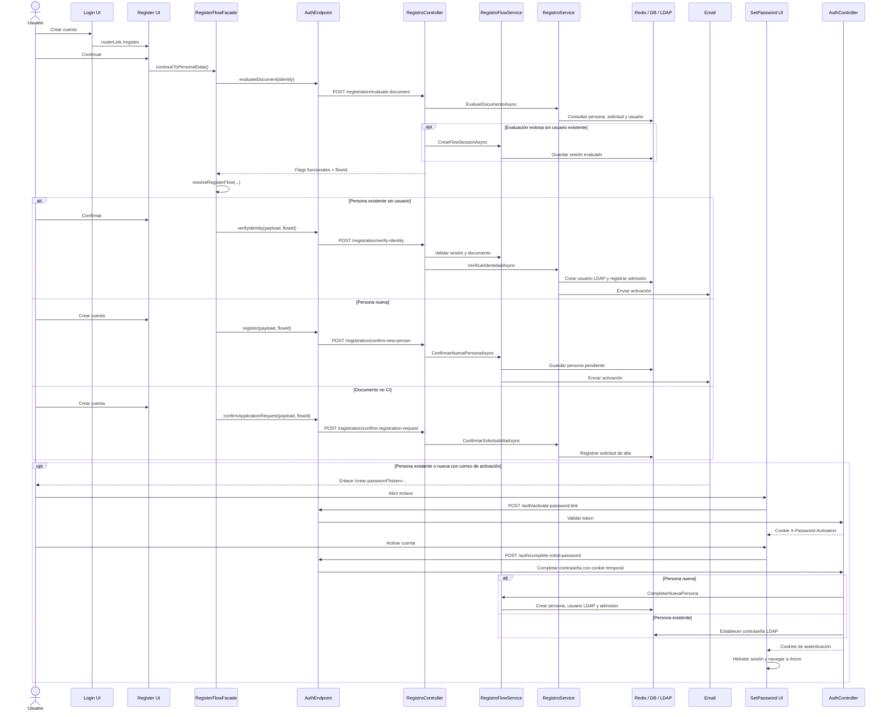

import SourceLink from '@site/src/components/SourceLink';

# Registro punta a punta

> Tipo: explanation

Este documento sigue el caso de uso desde **Crear cuenta** hasta la creación de
la contraseña. Las referencias históricas apuntan a commits verificados. Las fuentes vigentes usan las refs configuradas por el portal y requieren acceso a ambos repositorios privados.

## Recorrido completo

`new-application` termina al registrar la solicitud: no ejecuta el bloque de
activación ni crea una cuenta.

## Acciones y referencias

| Acción visible                   | Angular                                                        | Fachada / servicio                                                                                      | Adapter y contrato                                                                                                 | API                                                             | Backend                                                                                                                                     |
| -------------------------------- | -------------------------------------------------------------- | ------------------------------------------------------------------------------------------------------- | ------------------------------------------------------------------------------------------------------------------ | --------------------------------------------------------------- | ------------------------------------------------------------------------------------------------------------------------------------------- |
| **Crear cuenta** en login        | [`routerLink="/registro"`][front-login] y [ruta][front-routes] | —                                                                                                       | —                                                                                                                  | —                                                               | —                                                                                                                                           |
| **Continuar**                    | [Identity step y binding de página][front-register-page]       | [`continueToPersonalData()`][front-facade] → [`evaluateDocument()`][front-registration-service]         | [`AuthEndpoint.evaluateDocument()`][front-auth-endpoint] y [DTO backend][back-register-dtos]                       | `POST /registration/evaluate-document`                          | [`RegistroController`][back-register-controller] → [`RegistroService`][back-register-service] / [`RegistroFlowService`][back-register-flow] |
| **Confirmar** persona existente  | [Submit del paso personal][front-register-page]                | [`submitPersonalData()`][front-facade] → [`verifyExistingPersonIdentity()`][front-registration-service] | [`AuthEndpoint.verifyIdentity()`][front-auth-endpoint] y [DTO backend][back-register-dtos]                         | `POST /registration/verify-identity` + `X-Flow-Id`              | [`RegistroController`][back-register-controller] → [`RegistroService`][back-register-service]                                               |
| **Crear cuenta** persona nueva   | [Submit del paso personal][front-register-page]                | [`submitPersonalData()`][front-facade] → [`confirmRegistration()`][front-registration-service]          | [`AuthEndpoint.register()`][front-auth-endpoint] y [DTO backend][back-register-dtos]                               | `POST /registration/confirm-new-person` + `X-Flow-Id`           | [`RegistroController`][back-register-controller] → [`RegistroFlowService`][back-register-flow]                                              |
| **Crear cuenta** documento no CI | [Submit del paso personal][front-register-page]                | [`submitPersonalData()`][front-facade] → [`confirmRegistration()`][front-registration-service]          | [`AuthEndpoint.confirmApplicationRequest()`][front-auth-endpoint] y [DTO backend][back-register-dtos]              | `POST /registration/confirm-registration-request` + `X-Flow-Id` | [`RegistroController`][back-register-controller] → [`RegistroService`][back-register-service]                                               |
| Abrir enlace de activación       | [`activateToken()`][front-set-password]                        | [`PasswordActivationService.activateLink()`][front-password-service]                                    | [`AuthEndpoint.activatePasswordLink()`][front-auth-endpoint] y [controller/contrato OpenAPI][back-auth-controller] | `POST /auth/activate-password-link`                             | [`AuthController`][back-auth-controller] → [`PasswordActivationService`][back-password-activation]                                          |
| **Activar cuenta**               | [`submit()`][front-set-password]                               | [`PasswordActivationService.completePassword()`][front-password-service]                                | [`AuthEndpoint.completePassword()`][front-auth-endpoint] y [controller/contrato OpenAPI][back-auth-controller]     | `POST /auth/complete-initial-password` + cookie temporal        | [`AuthController`][back-auth-controller] → [`RegistroFlowService`][back-register-flow] para persona nueva                                   |

## Decisión inicial

La UI no consume directamente los flags del servidor. `resolveRegisterFlow(...)`
los traduce a un `RegisterFlowKind` estable y aplica esta prioridad:

| Prioridad | Respuesta backend                     | Flujo frontend       | Resultado                                 |
| --------- | ------------------------------------- | -------------------- | ----------------------------------------- |
| 1         | `userExists`                          | `user-exists`        | Informar y ofrecer login; no continúa     |
| 2         | `hasExistingApplication`              | `application-exists` | Informar solicitud pendiente; no continúa |
| 3         | CI + `requiresVerification`           | `existing-person`    | Pedir apellido y email                    |
| 4         | CI + `requiresPersonCreation`         | `new-person`         | Pedir datos personales completos          |
| 5         | No CI + `requiresApplicationCreation` | `new-application`    | Crear solicitud de alta                   |

Una combinación desconocida devuelve `null`: la fachada muestra un error y no
avanza.

## Sesiones y activación

Una evaluación exitosa crea una sesión Redis con estado `evaluado` siempre que
`userExists` sea falso. Esto incluye `application-exists`, aunque el
frontend no usa ese `flowId` porque el flujo es terminal.

| Dato                      | Duración predeterminada | Uso                                                                                                  |
| ------------------------- | ----------------------- | ---------------------------------------------------------------------------------------------------- |
| `X-Flow-Id`               | 30 minutos              | Vincula evaluación y confirmación; configurable con `Registro:FlowSessionMinutes`                    |
| Token y persona pendiente | 24 horas                | Enlace de activación y datos de una persona nueva; configurable con `PasswordActivation:ExpireHours` |
| `X-Password-Activation`   | 15 minutos              | Cookie HttpOnly limitada a `CompletarPassword`; configurable con `PasswordActivation:SessionMinutes` |

Los endpoints de confirmación validan estado `evaluado` y coincidencia de
tipo/número de documento. `VerificarIdentidad` y `ConfirmarSolicitudAlta`
cambian el estado a `confirmado` cuando terminan correctamente;
`ConfirmarNuevaPersona` lo hace después de enviar la activación. Si ese envío
falla, conserva los datos pendientes y el estado evaluado para reintentar. El
token se elimina de la URL del navegador antes de mostrar el formulario de
contraseña.

| Código    | Causa                          | Comportamiento                                  |
| --------- | ------------------------------ | ----------------------------------------------- |
| `FLOW_01` | Falta `X-Flow-Id`              | Responde 400 y no ejecuta el caso de uso        |
| `FLOW_02` | Sesión inexistente o expirada  | Responde 400; se debe reiniciar desde identidad |
| `FLOW_03` | Sesión ilegible o inválida     | Responde 400                                    |
| `FLOW_04` | Estado distinto al esperado    | Responde 400 y no repite la confirmación        |
| `FLOW_05` | Documento distinto al evaluado | Responde 400                                    |

## Campos, contratos y validaciones

Los contratos públicos del backend están en [`DtoRegistroRequests.cs`][back-register-dtos]
y las comparaciones para personas existentes en
[`RegistroValidationHelper.cs`][back-register-validation].

| Condición                        | Campos visibles                                                               | Frontend                          | Payload / backend                                                                                   |
| -------------------------------- | ----------------------------------------------------------------------------- | --------------------------------- | --------------------------------------------------------------------------------------------------- |
| Siempre                          | Tipo y número de documento                                                    | Ambos requeridos; CI se normaliza | `TipoDocumento`, `Documento`; `DocumentUtils.ValidarDocumentoBase`                                  |
| `existing-person`                | Primer apellido y email                                                       | Requeridos; email válido          | Deben coincidir con la persona; solo admite CI                                                      |
| `new-person` / `new-application` | Nombres, apellidos, nacimiento, sexo, ubicación, dirección, teléfono y emails | Formulario completo válido        | Nombres principales mínimo 2; email válido y confirmado; sexo M/F; país/estado/ciudad mayores que 0 |
| `user-exists`                    | Acción para login                                                             | No permite confirmar              | No se llama a confirmación                                                                          |
| `application-exists`             | Mensaje de solicitud pendiente                                                | No permite confirmar              | No se vuelve a crear la solicitud; el `flowId` recibido no se usa                                   |

El frontend valida que el teléfono principal sea celular y envía `primaryPhone`
como `{ nationalNumber, iso2 }`. El backend normaliza ese número y lo persiste en
formato E.164; `e164`, `countryCode` e `isValid` no se envían porque son
informativos y el servidor los recalcula o ignora.

El mapeo del teléfono es único para registro y para la edición de datos
personales, y vive en `src/app/shared/forms/phone.ts`:

- `toBackendPhone` arma el `primaryPhone` del request.
- `toPhoneValidationValue` arma el body de `POST /person/validate-phone-number`,
  resolviendo el prefijo del país a partir del `iso2`.
- `toPhoneInputValue` reconstruye el valor de `ort-phone-input` a partir de lo
  almacenado. `GET /person/details` devuelve `primaryPhone` como objeto: cuando
  `isValid` es `true` el servidor ya lo desarmó y se usan `nationalNumber` e
  `iso2` tal cual. Cuando es `false` el número quedó sin resolver —dato previo a
  la migración o una línea fija— y llega crudo, sin país: ahí se reprocesa el
  texto asumiendo `UY` si no viene en internacional (`+` o `00`), descartando el
  `0` de salida nacional. Un número internacional cuyo prefijo no se reconoce
  **no** se re-etiqueta: se envía tal cual con `iso2` nulo, que el contrato acepta.

Como ese default por país es una suposición, el formulario de datos personales
revalida el teléfono contra el servidor apenas lo carga y marca el campo en error
si lo rechaza, en lugar de persistir un número extranjero como uruguayo.
Por el mismo motivo, registro y edición esperan a que termine la validación
asíncrona antes de enviar: mientras está pendiente el formulario no es `invalid`
y el envío se saltearía el chequeo del número.

`EvaluarDocumento`, `VerificarIdentidad`, `AnalizarAdjunto`,
`ConfirmarNuevaPersona` y `ConfirmarSolicitudAlta` son públicos y están
protegidos por captcha. La sesión, el captcha y la cookie de activación son
controles independientes.

## Efectos por caso

| Flujo                | Endpoint                                          | Efecto y final del flujo                                                                                            |
| -------------------- | ------------------------------------------------- | ------------------------------------------------------------------------------------------------------------------- |
| `existing-person`    | `POST /registration/verify-identity`              | Crea usuario LDAP, registra admisión y envía activación. `CompletarPassword` establece la contraseña.               |
| `new-person`         | `POST /registration/confirm-new-person`           | Guarda la persona pendiente en Redis y envía activación. `CompletarPassword` crea persona, usuario LDAP y admisión. |
| `new-application`    | `POST /registration/confirm-registration-request` | Registra la solicitud; no envía activación ni crea contraseña. La UI muestra “Procesando tu solicitud”.             |
| `user-exists`        | Ninguno                                           | Ofrece iniciar sesión.                                                                                              |
| `application-exists` | Ninguno                                           | Informa la solicitud existente y permite corregir el documento; no ofrece iniciar sesión.                           |

Si el email de una persona nueva falla, los datos pendientes permanecen en
Redis y el backend devuelve un mensaje de reintento sin duplicarlos.

`application-exists` solo puede darse con documento no CI: `T_SOLICITUD_ALTA`
únicamente recibe documentos extranjeros. En ese estado no hay persona, usuario
LDAP ni contraseña, así que iniciar sesión o recuperar acceso son imposibles; la
UI muestra un aviso sin acción y mantiene el paso de identidad para permitir
corregir un documento mal tipeado.

## Pantalla final del registro

El destino lo decide `pendingReview`, el booleano que devuelven los dos endpoints
de confirmación dentro de `RegistrationFlowResult`. Es la única fuente de verdad:
el frontend no vuelve a mirar el tipo de documento ni el `RegisterFlowKind`.
`resolveRegistrationEnding()` traduce la respuesta a ruta y ambas reutilizan
`EmailConfirmation` con datos estáticos declarados en `auth.routes.ts`.

| `pendingReview` | `mailSent` | Ruta                                      | Título                    | Mensaje                                                                                                                                 |
| --------------- | ---------- | ----------------------------------------- | ------------------------- | --------------------------------------------------------------------------------------------------------------------------------------- |
| `true`          | `false`    | `/confirmacion-correo/solicitud-registro` | Procesando tu solicitud   | Solicitud recibida y en validación; el registro se completa en un plazo máximo de tres días hábiles ([Figma][figma-solicitud-registro]) |
| `false`         | `true`     | `/confirmacion-correo/registro`           | ¡Cuenta creada con éxito! | Enlace de activación enviado por correo                                                                                                 |
| `false`         | `false`    | `/confirmacion-correo/registro`           | ¡Cuenta creada con éxito! | La misma pantalla más un aviso: el correo no salió y la salida es «Recuperar acceso»                                                    |

`pendingReview: true` no promete correo alguno porque el backend no envía
activación para una solicitud de alta: queda pendiente de revisión manual.
`mailSent: false` con `pendingReview: false` es éxito parcial —la cuenta quedó
creada pero el correo de activación no salió—, así que el aviso lleva a
`/recuperar-acceso`, la única forma de definir la contraseña.

`verify-identity` devuelve `RegistrationConfirmationResponse`, que solo trae
`mailSent`: esa rama siempre crea usuario, así que se resuelve con
`pendingReview: false`.

Ninguno de los tres resultados expone `success`: el interceptor de
`OperationResult` convierte cualquier `success: false` en error HTTP, de modo que
un valor emitido siempre es un éxito y la falla viaja por el canal de excepción.

## OCR y casos borde

`POST /registration/analyze-attachment` acepta una imagen o PDF, tiene un límite de cinco
solicitudes por minuto por usuario/IP y solo precarga el formulario. Nunca decide
el flujo ni reemplaza `EvaluarDocumento`.

- Un documento inválido se rechaza antes de consultar persona, solicitud o LDAP.
- `userExists` corta el flujo aunque otros flags sean verdaderos.
- Volver al paso identidad limpia `RegisterFlowKind` y `flowId` en el frontend.
- Un `flowId` ausente impide cualquier confirmación continuable.
- Repetir una confirmación con estado `confirmado` falla por `FLOW_04`.
- Un enlace de activación expirado o reutilizado no crea la cookie temporal.

## Fuentes vigentes

- Frontend: <SourceLink repo="frontend" path="src/app/features/auth/facades/register-flow.facade.ts">RegisterFlowFacade</SourceLink>, <SourceLink repo="frontend" path="src/app/features/auth/services/registration.ts">RegistrationService</SourceLink> y <SourceLink repo="frontend" path="src/app/features/auth/endpoints/auth.endpoint.ts">HTTP adapter</SourceLink>.
- Backend: <SourceLink repo="backend" path="WebApiAdmisiones/WebApiAdmisiones/Controllers/RegistroController.cs">RegistroController</SourceLink> y <SourceLink repo="backend" path="WebApiAdmisiones/AppLogic/Registro/">módulo Registro</SourceLink>.

## Evidencia y configuración

- Backend: [tests del controller][back-register-controller-tests],
  [tests del servicio de registro][back-register-service-tests],
  [tests de sesión y persona pendiente][back-register-flow-tests],
  [tests de activación][back-password-tests] y
  [valores predeterminados][back-appsettings].
- Frontend: [tests de la fachada][front-facade-tests],
  [tests del adapter][front-endpoint-tests] y
  [tests de creación de contraseña][front-set-password-tests].

Los enlaces de Figma se agregan solamente cuando existe una URL verificada con
`node-id`. Nodo verificado disponible: [solicitud en revisión][figma-solicitud-registro].

[figma-solicitud-registro]: https://www.figma.com/design/opDCGX7LCg1vMO7soLF3Mr/Sistema-de-Admisiones-ORT?node-id=807-7399
[frontend-commit]: https://github.com/DesarrolloORT/admisiones/tree/91e3d7ba33774d9fa11db386fb64ce5eb751982f
[front-login]: https://github.com/DesarrolloORT/admisiones/blob/91e3d7ba33774d9fa11db386fb64ce5eb751982f/src/app/features/auth/pages/login/login.html#L91
[front-routes]: https://github.com/DesarrolloORT/admisiones/blob/91e3d7ba33774d9fa11db386fb64ce5eb751982f/src/app/features/auth/auth.routes.ts#L15-L20
[front-register-page]: https://github.com/DesarrolloORT/admisiones/blob/91e3d7ba33774d9fa11db386fb64ce5eb751982f/src/app/features/auth/pages/register/register.html#L11-L29
[front-facade]: https://github.com/DesarrolloORT/admisiones/blob/91e3d7ba33774d9fa11db386fb64ce5eb751982f/src/app/features/auth/facades/register-flow.facade.ts#L98-L243
[front-registration-service]: https://github.com/DesarrolloORT/admisiones/blob/91e3d7ba33774d9fa11db386fb64ce5eb751982f/src/app/features/auth/services/registration.ts#L38-L63
[front-auth-endpoint]: https://github.com/DesarrolloORT/admisiones/blob/91e3d7ba33774d9fa11db386fb64ce5eb751982f/src/app/features/auth/endpoints/auth.endpoint.ts#L230-L358
[front-set-password]: https://github.com/DesarrolloORT/admisiones/blob/91e3d7ba33774d9fa11db386fb64ce5eb751982f/src/app/features/auth/pages/set-password/set-password.ts#L155-L226
[front-password-service]: https://github.com/DesarrolloORT/admisiones/blob/91e3d7ba33774d9fa11db386fb64ce5eb751982f/src/app/features/auth/services/password-activation.ts
[front-facade-tests]: https://github.com/DesarrolloORT/admisiones/blob/91e3d7ba33774d9fa11db386fb64ce5eb751982f/src/app/features/auth/facades/register-flow.facade.spec.ts
[front-endpoint-tests]: https://github.com/DesarrolloORT/admisiones/blob/91e3d7ba33774d9fa11db386fb64ce5eb751982f/src/app/features/auth/endpoints/auth.endpoint.spec.ts
[front-set-password-tests]: https://github.com/DesarrolloORT/admisiones/blob/91e3d7ba33774d9fa11db386fb64ce5eb751982f/src/app/features/auth/pages/set-password/set-password.spec.ts
[backend-commit]: https://github.com/DesarrolloORT/api-admisiones/tree/6161d5deb2e5ef9d4a84930013481196a6fd5e1d
[back-register-controller]: https://github.com/DesarrolloORT/api-admisiones/blob/6161d5deb2e5ef9d4a84930013481196a6fd5e1d/WebApiAdmisiones/WebApiAdmisiones/Controllers/RegistroController.cs
[back-auth-controller]: https://github.com/DesarrolloORT/api-admisiones/blob/6161d5deb2e5ef9d4a84930013481196a6fd5e1d/WebApiAdmisiones/WebApiAdmisiones/Controllers/AuthController.cs#L205-L375
[back-register-service]: https://github.com/DesarrolloORT/api-admisiones/blob/6161d5deb2e5ef9d4a84930013481196a6fd5e1d/WebApiAdmisiones/AppLogic/Services/Registro/RegistroService.cs
[back-register-flow]: https://github.com/DesarrolloORT/api-admisiones/blob/6161d5deb2e5ef9d4a84930013481196a6fd5e1d/WebApiAdmisiones/AppLogic/Services/Registro/RegistroFlowService.cs
[back-password-activation]: https://github.com/DesarrolloORT/api-admisiones/blob/6161d5deb2e5ef9d4a84930013481196a6fd5e1d/WebApiAdmisiones/AppLogic/Services/Autenticacion/PasswordActivationService.cs#L219-L427
[back-register-dtos]: https://github.com/DesarrolloORT/api-admisiones/blob/6161d5deb2e5ef9d4a84930013481196a6fd5e1d/WebApiAdmisiones/AppLogic/Dtos/Registro/DtoRegistroRequests.cs
[back-register-validation]: https://github.com/DesarrolloORT/api-admisiones/blob/6161d5deb2e5ef9d4a84930013481196a6fd5e1d/WebApiAdmisiones/AppLogic/Helpers/ValidationHelpers/RegistroValidationHelper.cs
[back-appsettings]: https://github.com/DesarrolloORT/api-admisiones/blob/6161d5deb2e5ef9d4a84930013481196a6fd5e1d/WebApiAdmisiones/WebApiAdmisiones/appsettings.json#L19-L21
[back-register-controller-tests]: https://github.com/DesarrolloORT/api-admisiones/blob/6161d5deb2e5ef9d4a84930013481196a6fd5e1d/WebApiAdmisiones/UnitTesting/Controllers/RegistroControllerTests.cs
[back-register-service-tests]: https://github.com/DesarrolloORT/api-admisiones/blob/6161d5deb2e5ef9d4a84930013481196a6fd5e1d/WebApiAdmisiones/UnitTesting/AppLogic/Services/RegistroServiceTests.cs
[back-register-flow-tests]: https://github.com/DesarrolloORT/api-admisiones/blob/6161d5deb2e5ef9d4a84930013481196a6fd5e1d/WebApiAdmisiones/UnitTesting/AppLogic/Services/RegistroFlowServiceTests.cs
[back-password-tests]: https://github.com/DesarrolloORT/api-admisiones/blob/6161d5deb2e5ef9d4a84930013481196a6fd5e1d/WebApiAdmisiones/UnitTesting/AppLogic/Services/PasswordActivationServiceTests.cs
