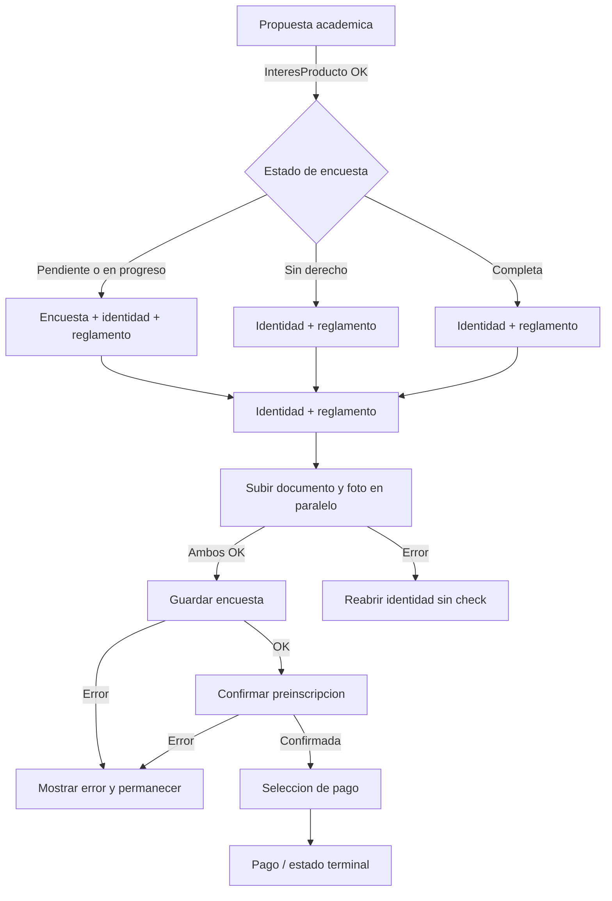

# Flow manual de inscripciones

> Tipo: reference

Fuente de verdad frontend: `src/app/features/inscriptions/**`.

Este documento describe el comportamiento actual de la pantalla: que campos
muestran u ocultan otros, que pasa cuando cambia una seleccion padre y que
valores llegan al backend. No uses el raw value de los formularios como contrato:
el contrato backend sale de `inscription-flow-mappers.ts`.

## Pasos y escenarios

El flujo tiene 3 pasos. El **paso 1** (Propuesta academica) avanza con
`POST /Inscripciones/InteresProducto`. El **paso 2** (Informacion personal)
guarda primero los cambios de identidad, luego llama a
`POST /Inscripciones/EncuestaInicial` y finalmente a
`POST /Inscripciones/ConfirmarPreInscripcion`. El **paso 3** (Confirmacion /
pago) llama a `POST /Inscripciones/Pagar`; el detalle vive en [PAYMENTS-FLOW.md](./PAYMENTS-FLOW.md).

Antes de entrar al paso 2 se consulta `GET /Inscripciones/EncuestaInicial`.
Si el usuario no tiene encuesta o la tiene en progreso, se muestran las
secciones de Educacion, decision academica, experiencia ORT, situacion
laboral, identidad y reglamento. Si `tieneDerechoEncuesta === false`, solo
se muestran identidad y reglamento. Si la encuesta ya viene completa no se
muestran secciones de encuesta.



## Regla general de valores ocultos

Cuando un campo padre cambia, la UI actualiza validadores y puede ocultar
campos hijos. En varios casos el valor crudo del hijo queda en el form, pero
el payload lo ignora y envia `null` cuando el padre indica que no aplica.

Excepciones que si limpian valores:

- Propuesta academica: cambiar `tipoPropuesta` limpia `carrera`, `comienzo` y
  `turno`; cambiar `carrera` limpia `comienzo` y `turno`; cambiar `comienzo`
  limpia `turno`.
- Bachillerato: cambiar `anioSecundaria` limpia `orientacion` si el valor anterior
  ya no existe en las orientaciones vigentes para ese año.
- Institucion educativa: cambiar `departamento` limpia `institucionEducativa`
  solo si el valor anterior no existe en el nuevo catalogo cargado.
- Pago: cambiar `metodoPago` a algo distinto de `cuenta-bancaria` limpia
  `banco`.

## Matriz de campos condicionales

| Condicion                               | Campo afectado                          | Validacion visible      | Limpieza al cambiar                 | Payload si no aplica                        |
| --------------------------------------- | --------------------------------------- | ----------------------- | ----------------------------------- | ------------------------------------------- |
| `cursaSecundaria = cursando`            | `anioSecundaria`                        | Requerido               | Conserva valor crudo                | `anioBachillerato = null`                   |
| Año con orientaciones                   | `orientacion`                           | Segun opciones vigentes | Limpia si la opcion deja de existir | `orientacionBachilleratoId = null`          |
| `recursaAnioBachillerato = si`          | `vecesRecursaAnioBachillerato`          | Entero mayor que 0      | Conserva valor crudo                | `vecesRecursaAnioBachillerato = null`       |
| `lugarSecundaria = 1`                   | Departamento e institucion como selects | Ambos requeridos        | Limpia solo una opcion inexistente  | Institucion libre en `nombreInstitucion...` |
| `lugarSecundaria != 1`                  | Institucion como texto libre            | Texto requerido         | Puede conservar el id anterior      | `institucionSecundariaId = null`            |
| `estadoEducacionSuperior = 1`           | `universidadesEducacionSuperior`        | Seleccion requerida     | Conserva valor crudo                | `universidadEducacionSuperiorIds = null`    |
| Universidad seleccionada incluye `0`    | Campo de universidad "Otro"             | Texto requerido         | Conserva valor crudo                | Lista de otros `null`                       |
| Formacion de madre o padre es `5` o `6` | `tituloOrtMadre` o `tituloOrtPadre`     | Si/no requerido         | Conserva valor crudo                | Egresado ORT `null`                         |
| `otrasUniversidades = si`               | `universidadesInformadas`               | Seleccion requerida     | Conserva valor crudo                | Ids y otros `null`                          |
| Experiencia ORT = `si`                  | Rating o medios correspondiente         | Requerido               | Conserva valor crudo                | Valoracion o medios `null`                  |
| `situacionLaboral = trabaja`            | `tipoJornadaLaboral`                    | Requerido               | Conserva valor crudo                | `tipoJornadaId = null`                      |
| Identidad completa desde backend        | `identidadCorrecta`                     | Checkbox requerido      | No se envia                         | Solo controla validez de UI                 |
| `metodoPago = cuenta-bancaria`          | `banco`                                 | Requerido               | Se limpia al elegir otro metodo     | Se envía como `idBancoSistarbanc`           |

Las referencias Figma se agregan a esta matriz cuando diseño entrega una URL
verificada al nodo exacto. No se publican enlaces generales ni placeholders.

## Casos borde consolidados

- Ocultar un control no garantiza que su valor crudo se elimine; los mappers son
  la frontera que envia `null` cuando no aplica.
- Cambiar la institucion de Uruguay a exterior puede conservar temporalmente el
  id anterior como texto.
- Una opcion dependiente se conserva mientras siga existiendo en el catalogo
  nuevo; si desaparece, se limpia.
- La encuesta completa oculta sus secciones, pero identidad y reglamento
  mantienen sus propias reglas.
- El paso de pago llama al backend; los pagos externos terminan en `pago-pendiente-externo` hasta que exista confirmación automática.
- `resultado=en-proceso` fuerza el estado terminal "Inscripcion en proceso" para
  cualquier metodo.

## Paso 1: propuesta academica

El paso tiene cuatro campos en cascada. `tipoPropuesta` es una constante local
filtrada por niveles disponibles (`1` carrera universitaria, `2` tecnicatura,
`3` actualizacion profesional); no se envia directo al backend pero filtra las
carreras disponibles. `carrera` usa el `idProducto` como string, proveniente de
`GET /Catalogos/Carreras`, y se envia como `idProducto` y `carreraId`. `comienzo`
usa el `idProceso` como string, proveniente de
`GET /Catalogos/Comienzos?idCarrera=<carrera>`, y se envia como
`idProcesoSeleccionado` y `comienzoId`. `turno` usa el `idOferta` como string,
proveniente de `GET /Catalogos/Turnos?idCarrera=<carrera>&idProceso=<comienzo>`,
y se envia como `idOferta` e `idOfertaSeleccionada`.

Al continuar se llama a `POST /Inscripciones/InteresProducto` con:

```json
{
  "idOferta": "Number(turno)",
  "idProcesoSeleccionado": "Number(comienzo)",
  "idProducto": "Number(carrera)"
}
```

## Paso 2: informacion personal

### Educacion

`cursaSecundaria` controla si se muestra `anioSecundaria`. Si pasa a
`no-cursando` el año queda crudo en el form pero no se envia; el backend recibe
`anioBachillerato = null`. Si cursa secundaria y el año elegido trae
orientaciones en `educacion.aniosBachillerato[].orientaciones`, se muestra
`orientacion` directamente. No hay selector intermedio de tipo nacional o
internacional. Si el año no trae orientaciones o cambia a uno donde la seleccion
anterior no existe, se envia `orientacionBachilleratoId = null`.

`recursaAnioBachillerato` es requerido. Si vale `si`, se muestra
`vecesRecursaAnioBachillerato` y se exige un numero mayor a 0. Si vale `no`, la
cantidad puede quedar cruda en el form pero el backend recibe
`vecesRecursaAnioBachillerato = null`.
`lugarSecundaria` decide el control de institucion educativa. Con valor `1`
(Uruguay) se muestran `departamento` e `institucionEducativa` como select; el
backend recibe `ubicacionUltimoAnioSecundariaId = 1`,
`institucionSecundariaId = Number(institucionEducativa)` y
`nombreInstitucionSecundaria = null`. Con valor `2` (exterior)
`institucionEducativa` pasa a texto libre; el backend recibe
`ubicacionUltimoAnioSecundariaId = 2`, `institucionSecundariaId = null` y
`nombreInstitucionSecundaria = <texto>`. Cambiar de Uruguay a exterior no limpia
el control, por lo que puede conservar el id anterior como texto.

`estadoEducacionSuperior = 1` muestra el multiple `universidadesEducacionSuperior`.
Si la seleccion incluye `Otro` (`0`), se muestra el `ortInput`
`universidadEducacionSuperiorOtro` y el backend recibe
`universidadEducacionSuperiorOtros = [texto]`. Si cambia a otro valor o no esta
seleccionado `0`, la seleccion y el texto pueden quedar crudos pero el backend
recibe `universidadEducacionSuperiorIds = null` o
`universidadEducacionSuperiorOtros = null`, segun corresponda.
`formacionMadre` con valor `5` o `6` muestra `tituloOrtMadre` (si/no). Si cambia
a otro valor el titulo queda crudo pero se envia `null`. Lo mismo aplica a
`formacionPadre` y `tituloOrtPadre`.

### Decision academica

`otrasUniversidades = si` muestra el multiple `universidadesInformadas`. Si la
seleccion incluye `Otro` (`0`), se muestra el `ortInput`
`universidadInformadaOtro` y el backend recibe `universidadConsideradaOtros =
[texto]`. Si pasa a `no`, la seleccion queda cruda pero el backend recibe
`universidadConsideradaIds = null` y `universidadConsideradaOtros = null`.
`certezaDecision` no tiene hijos condicionales; `1` es decidido/a y `2` es con
dudas, y se envia como `nivelDecisionId`.
Los campos directos de esta seccion son `anioDecisionCarrera` (`anioDecisionCarreraId`),
`apoyoDecision` (`apoyoDecisionId`), `anioDecisionOrt` (`anioDecisionOrtId`) y
`motivosOrt` (`motivoEleccionOrtIds`), todos con ids de catalogo.

### Experiencia con ORT

Cuatro campos booleanos (si/no) tienen ratings condicionales: `reunionAsesoramiento`,
`visitoWeb`, `visitoSede` y `recuerdaPublicidad`. En cada caso, si el campo padre
vale `si` se muestra el rating o multiple correspondiente (`calificacionAsesoramiento`,
`calificacionWeb`, `calificacionSede`, `mediosPublicidad`). Si cambia a `no`, el
valor hijo queda crudo pero el backend recibe `null` para ese campo. Los ratings
envian el numero elegido y las etiquetas salen del catalogo de valoraciones si esta
disponible.

### Situacion laboral

`situacionLaboral` con valor `trabaja` muestra `tipoJornadaLaboral`. El backend
recibe `trabajaActualmente = true` y `tipoJornadaId = Number(tipoJornadaLaboral)`.
Con `buscando` o `no-trabaja` no se muestra ningun hijo; el backend recibe
`trabajaActualmente = false` y `tipoJornadaId = null`. El valor viejo de jornada
queda crudo en el form pero se ignora.

Completar Situacion laboral solo valida y marca el expansible. No dispara llamadas
HTTP; la encuesta se guarda junto con el resto del cierre del paso 2.

### Identidad

Se precargan datos desde `GET /Persona/Documento` y `GET /Persona/Foto`. La
seccion requiere frente y dorso del documento (`File`, `image/jpeg` o `image/png`),
selfie (`File`, `image/jpeg` o `image/png`) y `vencimientoDocumento` (`Date`).

Si frente, dorso, vencimiento y selfie ya vinieron completos desde el backend, se
muestra el checkbox `Verifico que la identidad es correcta` (`identidadCorrecta`)
y la seccion queda invalida hasta marcarlo. Si alguno vino `null`, no se pide ese
checkbox: el flujo normal pide completar solo el dato faltante.

Si el usuario elimina un archivo, queda `null` y la seccion vuelve a invalida. Si
sube o cambia archivos, el front guarda esos cambios antes de confirmar la
preinscripcion. `identidadCorrecta` es solo de UI y no se envia al backend.

Al cerrar el paso 2, si se toco frente/dorso o cambio el vencimiento se llama a
`POST /Persona/SubirDocumento`; si se toco la selfie se llama a
`POST /Persona/SubirFoto`.

### Reglamento

`GET /Inscripciones/ReglamentoEstudiantil` indica si el reglamento ya fue aceptado.
Si ya fue aceptado, la UI oculta el checkbox y marca `aceptaReglamento = true`
automaticamente; el backend recibe `aceptoReglamento = true`. Si no fue aceptado,
se muestra un checkbox requerido y el backend recibe `aceptoReglamento = true`
solo si el usuario lo marca.

## Payload de encuesta inicial

Se envia con `POST /Inscripciones/EncuestaInicial` al cerrar el paso 2, despues de
guardar correctamente los cambios de identidad y antes de confirmar la
preinscripcion, siempre que el usuario tenga derecho a encuesta. Todos los campos
envian `null` cuando no aplican.

- `carreraId`: `Number(carrera)`.
- `comienzoId`: `Number(comienzo)`.
- `orientacionBachilleratoId`: `Number(orientacion)` si cursa secundaria y el año elegido tiene orientaciones.
- `anioBachillerato`: `Number(anioSecundaria)` si `cursaSecundaria = cursando`.
- `recursaAnioBachillerato`: `si -> true`, `no -> false`.
- `vecesRecursaAnioBachillerato`: cantidad solo si `recursaAnioBachillerato = si`; si no, `null`.
- `nivelFormacionPadreTutorId`: `Number(formacionPadre)`.
- `nivelFormacionMadreTutorId`: `Number(formacionMadre)`.
- `anioDecisionCarreraId`: `Number(anioDecisionCarrera)`.
- `anioDecisionOrtId`: `Number(anioDecisionOrt)`.
- `seInformoEnOtrasUniversidades`: `si -> true`, `no -> false`.
- `informacionOtrasUniversidadesLinea1` y `Linea2`: sin campo UI, siempre `null`.
- `apoyoDecisionId`: `Number(apoyoDecision)`.
- `institucionSecundariaId`: `Number(institucionEducativa)` solo si `lugarSecundaria = 1`.
- `nombreInstitucionSecundaria`: texto de `institucionEducativa` si `lugarSecundaria != 1`.
- `ubicacionUltimoAnioSecundariaId`: `Number(lugarSecundaria)`.
- `estadoEducacionSuperiorPreviaId`: `Number(estadoEducacionSuperior)`.
- `nivelDecisionId`: `Number(certezaDecision)`.
- `tuvoAsesoramientoOrt`: `si -> true`, `no -> false`.
- `valoracionAsesoramientoOrtId`: rating si `reunionAsesoramiento = si`.
- `visitoSitioWebOrt`: `si -> true`, `no -> false`.
- `valoracionSitioWebOrtId`: rating si `visitoWeb = si`.
- `visitoInstalacionesOrt`: `si -> true`, `no -> false`.
- `valoracionInstalacionesOrtId`: rating si `visitoSede = si`.
- `recuerdaPublicidadOrt`: `si -> true`, `no -> false`.
- `madreTutorEgresadoOrt`: `tituloOrtMadre` (`si -> true`, `no -> false`), solo si `formacionMadre` es `5` o `6`.
- `padreTutorEgresadoOrt`: `tituloOrtPadre` (`si -> true`, `no -> false`), solo si `formacionPadre` es `5` o `6`.
- `trabajaActualmente`: `trabaja -> true`; `buscando` o `no-trabaja -> false`.
- `tipoJornadaId`: `Number(tipoJornadaLaboral)` solo si `situacionLaboral = trabaja`.
- `universidadConsideradaIds`: `universidadesInformadas.map(Number)` solo si `otrasUniversidades = si`; incluye `0` si selecciona `Otro`.
- `universidadConsideradaOtros`: `[universidadInformadaOtro.trim()]` solo si `universidadConsideradaIds` incluye `0`; si no, `null`.
- `universidadEducacionSuperiorIds`: `universidadesEducacionSuperior.map(Number)` solo si `estadoEducacionSuperior = 1`; incluye `0` si selecciona `Otro`.
- `universidadEducacionSuperiorOtros`: `[universidadEducacionSuperiorOtro.trim()]` solo si `universidadEducacionSuperiorIds` incluye `0`; si no, `null`.
- `publicidadOrtIds`: `mediosPublicidad.map(Number)` solo si `recuerdaPublicidad = si`.
- `motivoEleccionOrtIds`: `motivosOrt.map(Number)`, `null` si no hay seleccion.

## Confirmacion de preinscripcion

Despues de completar la ultima seccion del paso 2 el front vuelve a validar todas
las secciones visibles. Si alguna quedo invalida por navegacion manual o borrador,
vuelve a esa seccion y no llama al backend de confirmacion.

Orden de cierre:

1. En paralelo, `POST /Persona/SubirDocumento` si se toco frente/dorso o cambio
   el vencimiento, y `POST /Persona/SubirFoto` si se toco la selfie.
2. `POST /Inscripciones/EncuestaInicial`, solo si las cargas de identidad
   requeridas terminaron correctamente y la persona tiene derecho a encuesta.
3. `POST /Inscripciones/ConfirmarPreInscripcion` con:

```json
{
  "aceptoReglamento": "Boolean(aceptaReglamento)",
  "idOfertaSeleccionada": "Number(turno)"
}
```

Si el backend responde `confirmada === true`, se avanza al paso de pago. Si no,
se muestra error y no se avanza. Si Documento o Foto falla por HTTP,
`OperationResult.success === false` o `data === false`, no se guarda la encuesta:
se conserva la seleccion de archivos y se reactiva Verificacion de identidad sin
el check de completada.

## Paso 3: pago

El detalle operativo del pago vive en [PAYMENTS-FLOW.md](./PAYMENTS-FLOW.md).
Resumen:

- El paso llama a `POST /Inscripciones/Pagar` con `idInscripcion`, método de pago
  y, para cuenta bancaria, `idBancoSistarbanc`.
- Cuenta bancaria conserva el valor UI `cuenta-bancaria`, pero el adapter envía
  `SISTARBANC`.
- `tarjeta-credito` no queda como método activo hasta que exista mapeo backend.
- Banred, Geopay y Sistarbanc redirigen a pasarela externa; como todavía no hay
  callback ni consulta de acreditación, el front termina en
  `pago-pendiente-externo` y no en un loader infinito.
- Abitab y Paganza quedan como reserva/pago pendiente externo con instrucciones.

## Catalogos usados

- Carreras: `GET /Catalogos/Carreras`
- Comienzos: `GET /Catalogos/Comienzos?idCarrera=<idProducto>`
- Turnos: `GET /Catalogos/Turnos?idCarrera=<idProducto>&idProceso=<idProceso>`
- Encuesta inicial: `GET /Catalogos/EncuestaInicial`
- Departamentos: `GET /Catalogos/PaisesEstadosCiudades` filtrando Uruguay (`codigoPais = 1`)
- Instituciones: `GET /Catalogos/Instituciones?codigoPais=1&codigoEstado=<departamento>`
- Bancos: `GET /Catalogos/Bancos`
