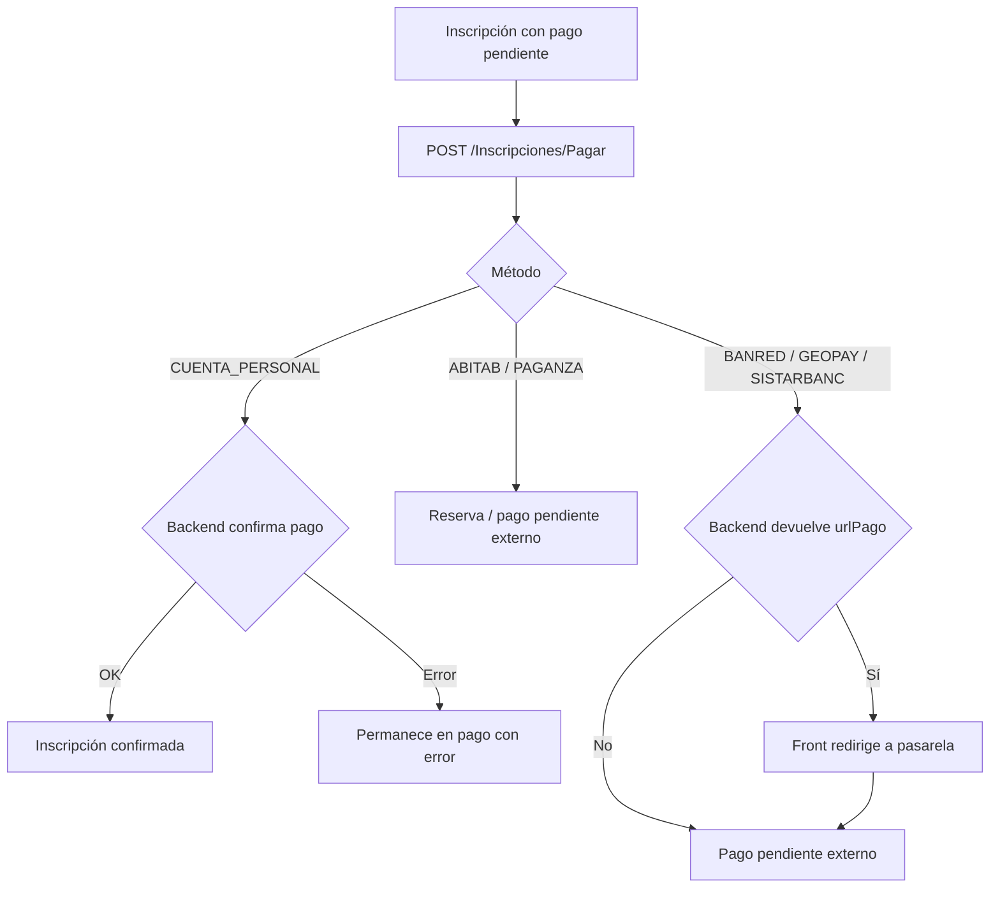

# Flow de pagos de inscripción

> Tipo: reference

Fuente de verdad frontend: `src/app/features/inscriptions/**`.

El pago parte de una inscripción con pago pendiente y llama a
`POST /Inscripciones/Pagar`. El front envía tipos propios de la feature al
adapter; solo `endpoints/` conoce el contrato generado.

## Contrato del paso

Payload feature:

```json
{
  "idInscripcion": 1072704,
  "metodoPago": "cuenta-bancaria",
  "idBancoSistarbanc": "brou"
}
```

Mapping adapter:

| UI                | API               | `idBancoSistarbanc` |
| ----------------- | ----------------- | ------------------- |
| `cuenta-personal` | `CUENTA_PERSONAL` | `null`              |
| `abitab`          | `ABITAB`          | `null`              |
| `paganza`         | `PAGANZA`         | `null`              |
| `banred`          | `BANRED`          | `null`              |
| `geopay`          | `GEOPAY`          | `null`              |
| `cuenta-bancaria` | `SISTARBANC`      | código del banco    |

`tarjeta-credito` no queda como método activo hasta que el backend confirme un
`tipoPago` propio o su mapeo dentro de Sistarbanc.

## Flujo por método



## Respuesta de `/Inscripciones/Pagar`

El adapter mapea `resultado`, `urlPago`, `parametrosEncriptados`, `mensajes` y el
bloque `confirmada` (número de estudiante, coordinación y materias) cuando el
backend confirma el pago en línea (p. ej. cuenta personal). Con eso la pantalla de
éxito pinta el detalle sin un `getDetail` adicional; ese `getDetail` queda solo
como fallback si la respuesta no trae `confirmada`.

## Estados frontend

- `processing`: solo mientras responde `/Inscripciones/Pagar`.
- `inscription-confirmada`: pago confirmado por backend. Usa `confirmada` de la
  respuesta de Pagar; si no vino, cae al `getDetail`.
- `reserva`: Abitab o Paganza quedan con instrucciones de pago. Se muestran la
  cédula (Abitab), el número de estudiante y el monto que informa `seniaMinima`.
  En el flujo fresco se consultan con un `getDetail` tras quedar en reserva; si
  falla, se muestra solo el monto.
- `pago-pendiente-externo`: Banred, Geopay o Sistarbanc ya salieron a pasarela o
  quedaron esperando definición de acreditación.
- `editing`: errores de validación o error de backend; el usuario puede corregir
  y reintentar.

## Brecha pendiente

Para Banred, Geopay y Sistarbanc el front redirige fuera del proyecto. Hoy este
proyecto no recibe callback ni consulta de estado para saber si el usuario pagó.
Por eso el estado default al volver o no poder confirmar es
`pago-pendiente-externo`, nunca un loader infinito.

Cuando backend defina callback, polling o endpoint de consulta, ese mecanismo debe
actualizar este estado a `inscription-confirmada` o mostrar error final.

### Contrato con las páginas Pagos\*Gestion.aspx

Las tres pasarelas intermedias (`PagosBanRedGestion.aspx`,
`PagosGeoPayGestion.aspx`, `PagosSistarbancGestion.aspx`, en LogicaORT) leen el
POST así: `Request.Form["data"].Split('=')[1].Split('"')[0]` — extraen lo que
está entre el primer `=` y la primera `"`. Por eso el front envía
`data = {"params":"parametrosEncriptados=<blob>"}` (mismo formato que Gestion_V2
en producción). El backend de admisiones ya le quitó el prefijo
`parametrosEncriptados=` a la URL original (`SepararUrlYParametrosEncriptados`
en `InscripcionesService.cs`), así que el front lo reconstruye.

### Salteo del intermediario ASPX (propuesta a backend)

El ASPX desencripta el blob, crea la transacción contra BanRed y recién ahí
redirige a la pasarela. El front no puede replicar ese paso: la clave de
desencriptación es server-side.

Propuesta: que `POST /Inscripciones/Pagar` devuelva directamente la URL final de
la pasarela (BanRed) ya resuelta. Con eso admisiones muestra todo el detalle del
pago en su propia pantalla y redirige sin pasar por el ASPX intermedio.
