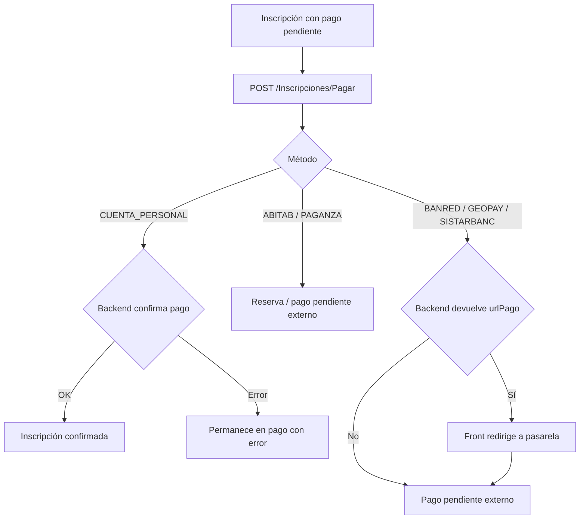

# Flow de pagos de inscripción

> Tipo: reference

Fuente de verdad frontend: `src/app/features/inscriptions/**`.

El pago parte de una inscripción con pago pendiente y llama a
`POST /Inscripciones/Pagar`. El front envía tipos propios de la feature al
adapter; solo `endpoints/` conoce el contrato generado.

## Contrato del paso

Payload feature:

```json
{
  "idInscripcion": 1072704,
  "metodoPago": "cuenta-bancaria",
  "idBancoSistarbanc": "brou"
}
```

Mapping adapter:

| UI                | API               | `idBancoSistarbanc` |
| ----------------- | ----------------- | ------------------- |
| `cuenta-personal` | `CUENTA_PERSONAL` | `null`              |
| `abitab`          | `ABITAB`          | `null`              |
| `paganza`         | `PAGANZA`         | `null`              |
| `banred`          | `BANRED`          | `null`              |
| `geopay`          | `GEOPAY`          | `null`              |
| `cuenta-bancaria` | `SISTARBANC`      | código del banco    |

`tarjeta-credito` no queda como método activo hasta que el backend confirme un
`tipoPago` propio o su mapeo dentro de Sistarbanc.

## Flujo por método



## Estados frontend

- `processing`: solo mientras responde `/Inscripciones/Pagar`.
- `inscription-confirmada`: pago confirmado por backend.
- `reserva`: Abitab o Paganza quedan con instrucciones de pago externo.
- `pago-pendiente-externo`: Banred, Geopay o Sistarbanc ya salieron a pasarela o
  quedaron esperando definición de acreditación.
- `editing`: errores de validación o error de backend; el usuario puede corregir
  y reintentar.

## Brecha pendiente

Para Banred, Geopay y Sistarbanc el front redirige fuera del proyecto. Hoy este
proyecto no recibe callback ni consulta de estado para saber si el usuario pagó.
Por eso el estado default al volver o no poder confirmar es
`pago-pendiente-externo`, nunca un loader infinito.

Cuando backend defina callback, polling o endpoint de consulta, ese mecanismo debe
actualizar este estado a `inscription-confirmada` o mostrar error final.
